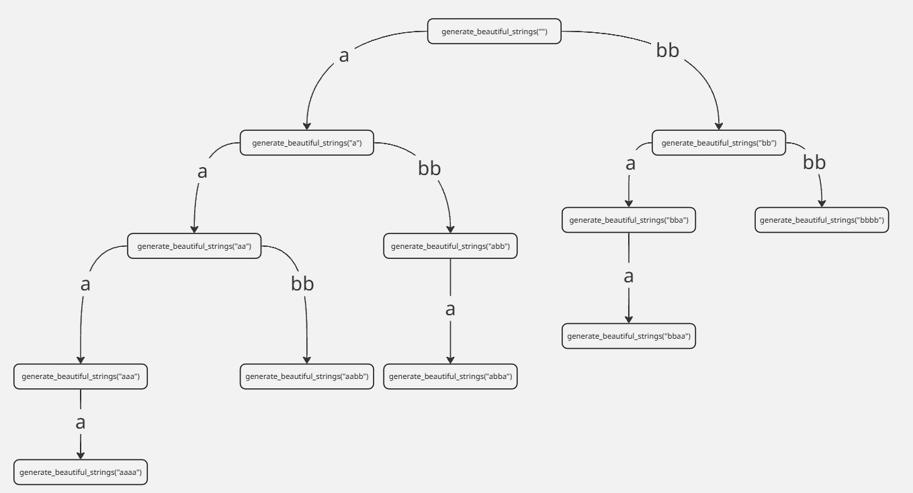
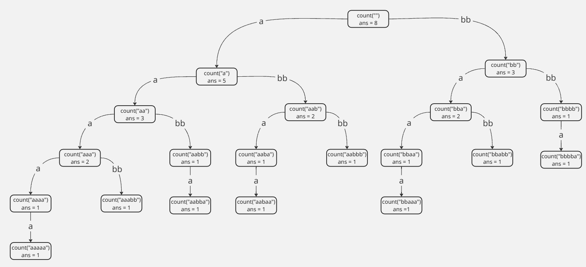
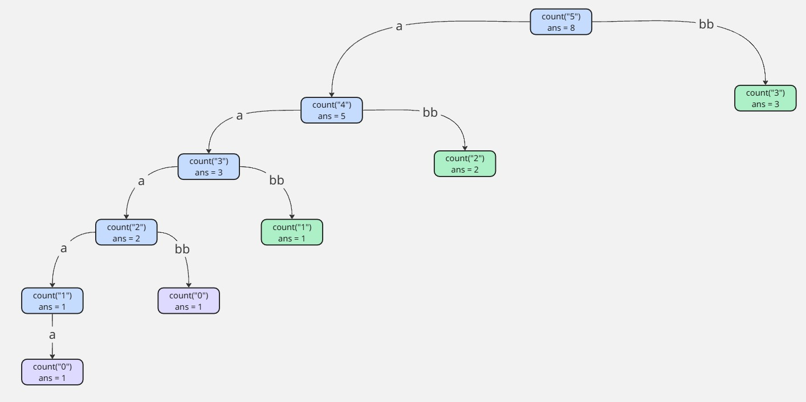

### مقدمة إلى البرمجة الديناميكية

**البرمجة الديناميكية (DP)** هي تقنية قوية في علوم الحاسب والرياضيات لحل المشكلات التي يمكن تقسيمها إلى مشاكل فرعية متداخلة. بدلاً من حل نفس المشاكل الفرعية مراراً وتكراراً، تقوم DP بحل كل مشكلة فرعية **مرة واحدة** وتخزين نتيجتها، عادةً في جدول أو مصفوفة، بحيث يمكن إعادة استخدامها لاحقاً. هذا النهج يوفر زمن الحساب وغالباً ما يحول التعقيد الزمني الأسي إلى زمن كثير الحدود.

#### كيفية الاقتراب من حلول البرمجة الديناميكية

عادةً، أول شيء نفكر فيه عند حل أي مشكلة هو الحل الشامل بالقوة الغاشمة. أحياناً يكون النهج بالقوة الغاشمة هو إجراء بحث كامل بكتابة دالة عودية تولد جميع الاحتمالات.

##### مثال على المشكلة

يُعطى ثلاثة أعداد صحيحة $n$ و $a$ و $b$. جد جميع السلاسل الممكنة بطول $n$ التي يمكن تشكيلها بربط أي عدد من الكتل، حيث كل كتلة إما:

- سلسلة بطول $a$ تحتوي فقط على الحرف `'a'`، أو
- سلسلة بطول $b$ تحتوي فقط على الحرف `'b'`.

يجب أن يكون طول كل سلسلة تماماً $n$ ويتم بناؤها بربط هذه الكتل (بأي ترتيب وتركيبة).

على سبيل المثال، إذا كان $n = 4$ و $a = 1$ و $b = 2$:

السلاسل الممكنة هي:

```
"aaaa", "aabb", "abba", "bbaa", "bbbb"
```

يمكننا كتابة حل شامل بالقوة الغاشمة يعد جميع السلاسل بهذه الطريقة:

=== "c++"

```c++
#include <iostream>
#include <string>
#include <vector>
using namespace std;

vector< string > beautiful_strings;

void generate_beautiful_strings(string s,int n,int a,int b){
    if((int)s.size() == n){
        beautiful_strings.push_back(s);
        return;
    }
    if((int)s.size() + a <= n)
        generate_beautiful_strings(s + string(a, 'a'), n, a, b);
    if((int)s.size() + b <= n)
        generate_beautiful_strings(s + string(b, 'b'), n, a, b);
}

int main() {
    int n, a, b;
    cin >> n >> a >> b;
    generate_beautiful_strings("", n, a, b);
    cout << (int)beautiful_strings.size() << endl;
    for(string s : beautiful_strings)
        cout << s << endl;
    return 0;
}
```

=== "Java"

```java
import java.util.ArrayList;
import java.util.List;
import java.util.Scanner;

public class BeautifulStrings {
    private static final List<String> beautifulStrings = new ArrayList<>();

    private static void generateBeautifulStrings(String s, int n, int a, int b) {
        if (s.length() == n) {
            beautifulStrings.add(s);
            return;
        }
        if (s.length() + a <= n) {
            generateBeautifulStrings(s + "a".repeat(a), n, a, b);
        }
        if (s.length() + b <= n) {
            generateBeautifulStrings(s + "b".repeat(b), n, a, b);
        }
    }

    public static void main(String[] args) {
        Scanner sc = new Scanner(System.in);
        int n = sc.nextInt();
        int a = sc.nextInt();
        int b = sc.nextInt();
        sc.close();

        generateBeautifulStrings("", n, a, b);

        System.out.println(beautifulStrings.size());
        for (String s : beautifulStrings) {
            System.out.println(s);
        }
    }
}
```

=== "Python"

```python
beautiful_strings = []

def generate_beautiful_strings(s: str, n: int, a: int, b: int) -> None:
    if len(s) == n:
        beautiful_strings.append(s)
        return
    if len(s) + a <= n:
        generate_beautiful_strings(s + 'a' * a, n, a, b)
    if len(s) + b <= n:
        generate_beautiful_strings(s + 'b' * b, n, a, b)

def main():
    n, a, b = map(int, input().split())
    generate_beautiful_strings("", n, a, b)
    print(len(beautiful_strings))
    for s in beautiful_strings:
        print(s)

if __name__ == "__main__":
    main()
```

دعونا نلقي نظرة على الاستدعاءات العودية التي ستحدث عندما $n=4$ و $a=1$ و $b=2$ باستخدام الحل السابق:



---

#### إعادة التفكير في المشكلة

الآن نحتاج إلى تغيير طريقة تفكيرنا. بدلاً من توليد جميع الاحتمالات، علينا التفكير في كيفية بناء الحل عن طريق تقسيم المشكلة إلى مشاكل فرعية أصغر.

نبدأ بتعريف المشكلة التي نحلها. نأخذ سلسلة بطول $0$، ولدينا خياران: إما إلحاق كتلة بحجم $a$ أو كتلة بحجم $b$. عند استدعاء الدالة عودياً نعتبر هذا استدعاء إلى مشكلة فرعية. لكن ما هي المشكلة الفرعية تحديداً؟

في المثال، عندما نلحق `a`، تنتقل الحالة إلى أننا ملأنا خانة واحدة وبقيت لدينا $n-1$ خانات. وعند إلحاق `bb`، تنتقل الحالة إلى أننا ملأنا خانتين وبقيت لدينا $n-2$ خانات.

الحلول الناتجة:

```
"aaaa", "aabb", "abba"
```

من الخيار الأول، و

```
"bbaa", "bbbb"
```

من الخيار الثاني.

تشكل هذه الحلول معاً الجواب الكامل.

---

#### حل المشكلة بالجمع بين النتائج

عدد الاحتمالات هو مجموع الاحتمالات الناتجة عن الخيارين، لذا نكتب دالة عودية تعيد عدد الحلول لكل مشكلة فرعية ثم نجمعهما.

=== "c++"

```c++
#include <iostream>
#include <string>
using namespace std;

int count_beautiful_strings(string s, int n, int a, int b) {
    if ((int)s.size() == n) {
        return 1;
    }
    int ans = 0;
    if ((int)s.size() + a <= n)
        ans += count_beautiful_strings(s + string(a, 'a'), n, a, b);
    if ((int)s.size() + b <= n)
        ans += count_beautiful_strings(s + string(b, 'b'), n, a, b);
    return ans;
}

int main() {
    int n, a, b;
    cin >> n >> a >> b;
    cout << count_beautiful_strings("", n, a, b) << endl;
    return 0;
}
```

=== "Java"

```java
import java.util.Scanner;

public class BeautifulStrings {

    public static int countBeautifulStrings(String s, int n, int a, int b) {
        if (s.length() == n) {
            return 1;
        }
        int ans = 0;
        if (s.length() + a <= n) {
            ans += countBeautifulStrings(s + "a".repeat(a), n, a, b);
        }
        if (s.length() + b <= n) {
            ans += countBeautifulStrings(s + "b".repeat(b), n, a, b);
        }
        return ans;
    }

    public static void main(String[] args) {
        Scanner scanner = new Scanner(System.in);
        int n = scanner.nextInt();
        int a = scanner.nextInt();
        int b = scanner.nextInt();
        System.out.println(countBeautifulStrings("", n, a, b));
    }
}
```

=== "Python"

```python
def count_beautiful_strings(s, n, a, b):
    if len(s) == n:
        return 1
    ans = 0
    if len(s) + a <= n:
        ans += count_beautiful_strings(s + 'a' * a, n, a, b)
    if len(s) + b <= n:
        ans += count_beautiful_strings(s + 'b' * b, n, a, b)
    return ans

def main():
    n, a, b = map(int, input().split())
    print(count_beautiful_strings("", n, a, b))

if __name__ == "__main__":
    main()
```

هذا توضيح لشجرة الاستدعاءات عندما $n=5$ و $a=1$ و $b=2$:



نلاحظ أن الدالة `count(3)` استُدعيت مرتين، وفي كلا المرتين أعادت `ans = 3`. لأننا نحاول حل نفس المشكلة مراراً، فمن الطبيعي أن النتيجة متطابقة — وهنا تأتي أهمية **التخزين المؤقت**.

---

#### التخزين المؤقت (Memoization)

**التخزين المؤقت** هو تقنية لحفظ نتائج استدعاءات الدوال المكلفة وإرجاع النتيجة المخزنة عندما تتكرر نفس المدخلات.

**البرمجة الديناميكية** هي استراتيجية لحل المشكلات التي تحتوي على **مشاكل فرعية متداخلة**، و**التخزين المؤقت** هو طريقة لتنفيذ البرمجة الديناميكية باستخدام العودية وتخزين نتائج الحسابات السابقة.

دعونا نعدّل الكود لإضافة التخزين المؤقت. نفترض أن حد $n$ يصل إلى $10^5$، إذ سنعرف مصفوفة `dp` بحجم $N+1` لتخزين الأجوبة. نستخدم القيمة `-1` للإشارة إلى أن المشكلة الفرعية لم تُحل بعد.

=== "c++"

```c++
#include <iostream>
#include <cstring>
using namespace std;
const int N = 100000;
int dp[N + 1];

int count_beautiful_strings(int n, int a, int b) {
    if (n == 0) {
        return 1;
    }
    if (dp[n] != -1) {
        return dp[n];
    }
    int ans = 0;
    if (a <= n)
        ans += count_beautiful_strings(n - a, a, b);
    if (b <= n)
        ans += count_beautiful_strings(n - b, a, b);
    return dp[n] = ans;
}

int main() {
    int n, a, b;
    cin >> n >> a >> b;
    memset(dp, -1, sizeof(dp));
    cout << count_beautiful_strings(n, a, b) << endl;
    return 0;
}
```

=== "Java"

```java
import java.util.Arrays;
import java.util.Scanner;

public class BeautifulStringsMemo {
    static final int N = 100000;
    static int[] dp = new int[N + 1];

    public static int countBeautifulStrings(int n, int a, int b) {
        if (n == 0) {
            return 1;
        }
        if (dp[n] != -1) {
            return dp[n];
        }
        int ans = 0;
        if (a <= n) {
            ans += countBeautifulStrings(n - a, a, b);
        }
        if (b <= n) {
            ans += countBeautifulStrings(n - b, a, b);
        }
        return dp[n] = ans;
    }

    public static void main(String[] args) {
        Scanner scanner = new Scanner(System.in);
        int n = scanner.nextInt();
        int a = scanner.nextInt();
        int b = scanner.nextInt();
        Arrays.fill(dp, -1);
        System.out.println(countBeautifulStrings(n, a, b));
    }
}
```

=== "Python"

```python
import sys
sys.setrecursionlimit(1000000)

N = 100000
dp = [-1] * (N + 1)

def count_beautiful_strings(n, a, b):
    if n == 0:
        return 1
    if dp[n] != -1:
        return dp[n]
    ans = 0
    if a <= n:
        ans += count_beautiful_strings(n - a, a, b)
    if b <= n:
        ans += count_beautiful_strings(n - b, a, b)
    dp[n] = ans
    return ans

def main():
    n, a, b = map(int, input().split())
    print(count_beautiful_strings(n, a, b))

if __name__ == "__main__":
    main()
```

---

#### تحليل التعقيد

قبل استخدام التخزين المؤقت، إذا كان $a$ و $b$ مساويين لـ1، نتحصل على شجرة ثنائية كاملة بعمق $n$، مما يؤدي إلى تعقيد زمني $O(2^n)$ في أسوأ الحالات، وهو غير مقبول.

عند استخدام التخزين المؤقت، نحُل كل مشكلة فرعية مرة واحدة فقط. ثم عندما نعاود استدعاء نفس المشكلة الفرعية، نعيد النتيجة المخزنة في $O(1)$. بالتالي يكون التعقيد الكلي هو:

```
عدد الحالات المتميزة × زمن حل كل حالة ≃ n × O(1) = O(n)
```

---

هذا توضيح لشجرة الاستدعاءات بعد تطبيق التخزين المؤقت عندما $n=5$ و $a=1$ و $b=2$:


