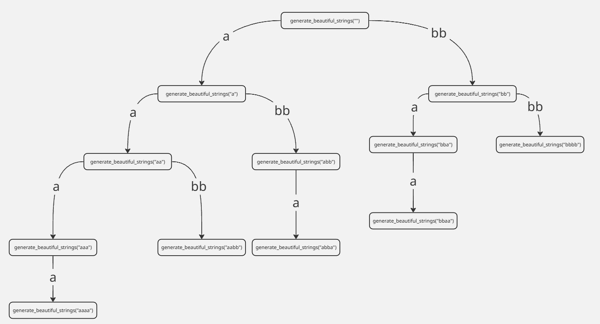

### Intorduction to Dynamic Programming

**Dynamic Programming (DP)** is a powerful technique in computer science and mathematics for solving problems that can be broken down into smaller overlapping subproblems. Instead of solving the same subproblems repeatedly, DP solves each subproblem **once** and stores its result, usually in a table or array, so that it can be reused later. This approach saves computation time and often reduces an exponential time complexity to polynomial time.

#### How to approch to Dynamic Programming solutions

Usually, the first thing to think of when solving any problem is the brute-force solution. Sometimes the brute-force approach is to complete a search by writing a recursive function that generates all the possibilities.

##### Example Problem

You are given three integers $n$, $a$, and $b$. Find all possible strings of length $n$ that can be formed by concatenating any number of blocks, where each block is either:

- a string of length $a$ consisting only of the character `'a'`, or

- a string of length $b$ consisting only of the character `'b'`.

Each string must be exactly of length $n$ and constructed by concatenating these blocks (in any order and combination).

For example, if $n = 4$, $a = 1$, and $b = 2$:

The possible strings are:

```
"aaaa", "aabb", "abba", "bbaa", "bbbb"
```

We can write a complete-search solution that counts all possible strings this way:

=== "c++"

```c++
#include <iostream>
#include <string>
using namespace std;

void generate_beautiful_strings(string s,int &counter,int n,int a,int b){
    if((int)s.size() == n){
        counter++;
        return;
    }
    if((int)s.size() + a <= n)
        generate_beautiful_strings(s + string(a, 'a'), counter, n, a, b);
    if((int)s.size() + b <= n)
        generate_beautiful_strings(s + string(b, 'b'), counter, n, a, b);
}

int main() {
    int n, a, b;
    cin >> n >> a >> b;
    int ans = 0;
    generate_beautiful_strings("", ans, n, a, b);
    cout << ans << endl;
    return 0;
}
```

=== "Java"

```java
import java.util.Scanner;

public class BeautifulStrings {

    public static void generateBeautifulStrings(String s, int[] counter, int n, int a, int b) {
        if (s.length() == n) {
            counter[0]++;
            return;
        }
        if (s.length() + a <= n) {
            generateBeautifulStrings(s + "a".repeat(a), counter, n, a, b);
        }
        if (s.length() + b <= n) {
            generateBeautifulStrings(s + "b".repeat(b), counter, n, a, b);
        }
    }

    public static void main(String[] args) {
        Scanner scanner = new Scanner(System.in);
        int n = scanner.nextInt();
        int a = scanner.nextInt();
        int b = scanner.nextInt();

        int[] counter = new int[1]; // Use array to simulate pass-by-reference
        generateBeautifulStrings("", counter, n, a, b);
        System.out.println(counter[0]);
    }
}
```

=== "Python"

```python
def generate_beautiful_strings(s, counter, n, a, b):
    if len(s) == n:
        counter[0] += 1
        return
    if len(s) + a <= n:
        generate_beautiful_strings(s + 'a' * a, counter, n, a, b)
    if len(s) + b <= n:
        generate_beautiful_strings(s + 'b' * b, counter, n, a, b)

def main():
    n, a, b = map(int, input().split())
    counter = [0]  # Use list to simulate pass-by-reference
    generate_beautiful_strings("", counter, n, a, b)
    print(counter[0])

if __name__ == "__main__":
    main()
```

Let's take a look at the recursive calls that are going to happen when $n=4$, $a=1$, $b=2$, when we use the previous solution:



Now we need to change the way we think about the problem. Instead of generating all possibilities, we need to think about how we are going to build the answer to our problem by breaking it into smaller subproblems.

Now we need to define the problem we are solving. We start with a string of length $0$, and we have two options: to append a block of size $a$ or a block of size $b$, then we do a recursive call to generate the solution. Instead, we need to think of the recursive call as a subproblem. But what exactly is the problem we are solving here?

The problem we are solving in the example is that we have a string of length $4$, then we try appending `a`. After that, the state that we are in is that we filled one index, and we have $3$ remaining. We also try to append `bb` and move to the state where we filled $2$ indices and have $2$ remaining.

The solutions after going to the first option are:

```
"aaaa", "aabb", "abba"
```

The solutions after going to the second option are:

```
"bbaa", "bbbb"
```

The solutions of both options form the solution to our problem.

Let's rewrite the code in a different way. The number of possibilities is the sum of the number of possibilities of the two options we have in our problem, so we will write a recursive function that returns the answer to each subproblem and calculates their sum as the answer to our problem.

When we reach the point that we have already filled the $n$ characters, this is our base case, where we found one of the possibilities, so the answer to this base case is $1$.

The code will look like:

=== "c++"

```c++
#include <iostream>
#include <string>
using namespace std;

int count_beautiful_strings(string s,int n,int a,int b){
    if((int)s.size() == n){
        return 1;
    }
    int ans = 0;
    if((int)s.size() + a <= n)
        ans += count_beautiful_strings(s + string(a, 'a'), n, a, b);
    if((int)s.size() + b <= n)
        ans += count_beautiful_strings(s + string(b, 'b'), n, a, b);
    return ans;
}

int main() {
    int n, a, b;
    cin >> n >> a >> b;
    cout << count_beautiful_strings("", n, a, b) << endl;
    return 0;
}
```

=== "Java"

```java
import java.util.Scanner;

public class BeautifulStrings {

    public static int countBeautifulStrings(String s, int n, int a, int b) {
        if (s.length() == n) {
            return 1;
        }
        int ans = 0;
        if (s.length() + a <= n) {
            ans += countBeautifulStrings(s + "a".repeat(a), n, a, b);
        }
        if (s.length() + b <= n) {
            ans += countBeautifulStrings(s + "b".repeat(b), n, a, b);
        }
        return ans;
    }

    public static void main(String[] args) {
        Scanner scanner = new Scanner(System.in);
        int n = scanner.nextInt();
        int a = scanner.nextInt();
        int b = scanner.nextInt();
        System.out.println(countBeautifulStrings("", n, a, b));
    }
}
```

=== "Python"

```python
def count_beautiful_strings(s, n, a, b):
    if len(s) == n:
        return 1
    ans = 0
    if len(s) + a <= n:
        ans += count_beautiful_strings(s + 'a' * a, n, a, b)
    if len(s) + b <= n:
        ans += count_beautiful_strings(s + 'b' * b, n, a, b)
    return ans

def main():
    n, a, b = map(int, input().split())
    print(count_beautiful_strings("", n, a, b))

if __name__ == "__main__":
    main()
```

This is a demonstration of the recursion tree when $n=5$, $a=1$, and $b=2$, where each recursive call represents a problem, and the answer will be the sum of the two subproblems under it.


Let's take a look at the tree above. We can see that `count("bb")` and `count("aa")` have the same answer, and their subtrees look the same.

So let's try to understand the problem better. We start with a problem to fill a string of length $n$ in a specific way. When we try some option like filling $a$ characters in the beginning, there will be $n-a$ remaining unfilled characters. When we try to solve a subproblem, we don't care about the characters we filled before, so the situation we are currently in only relies on the remaining unfilled characters. So we can define the subproblem with the number of remaining characters only.

So let's change our recursive function so it takes an integer $n$ as a parameter, where $n$ is the number of characters we need to fill in the string. Then we know that the first option is to fill $a$ characters and have $n-a$ remaining ones, and the second option is to fill $b$ characters leaving $n-b$ unfilled ones. Our base case here is $n=0$ because we reach a point where we need to fill $0$ characters, so we already filled everything and got a correct string.

The code will become:

=== "c++"

```c++
#include <iostream>
#include <string>
using namespace std;

int count_beautiful_strings(int n,int a,int b){
    if(n == 0){
        return 1;
    }
    int ans = 0;
    if(a <= n)
        ans += count_beautiful_strings(n - a, a, b);
    if(b <= n)
        ans += count_beautiful_strings(n - b, a, b);
    return ans;
}

int main() {
    int n, a, b;
    cin >> n >> a >> b;
    cout << count_beautiful_strings(n, a, b) << endl;
    return 0;
}
```

=== "Java"

```java
import java.util.Scanner;

public class BeautifulStrings {

    public static int countBeautifulStrings(int n, int a, int b) {
        if (n == 0) {
            return 1;
        }
        int ans = 0;
        if (a <= n) {
            ans += countBeautifulStrings(n - a, a, b);
        }
        if (b <= n) {
            ans += countBeautifulStrings(n - b, a, b);
        }
        return ans;
    }

    public static void main(String[] args) {
        Scanner scanner = new Scanner(System.in);
        int n = scanner.nextInt();
        int a = scanner.nextInt();
        int b = scanner.nextInt();
        System.out.println(countBeautifulStrings(n, a, b));
    }
}
```

=== "Python"

```python
def count_beautiful_strings(n, a, b):
    if n == 0:
        return 1
    ans = 0
    if a <= n:
        ans += count_beautiful_strings(n - a, a, b)
    if b <= n:
        ans += count_beautiful_strings(n - b, a, b)
    return ans

def main():
    n, a, b = map(int, input().split())
    print(count_beautiful_strings(n, a, b))

if __name__ == "__main__":
    main()
```

This is a demonstration of the recursion tree when $n=5$, $a=1$, and $b=2$.


Let's take a look again at this tree. We can see that the function `count(3)` was called twice. In both times, it returned with `ans = 3`. Because we are solving the same problem, obviously it will return with the same answer — and here comes the idea of memoization.

**Memoization** is the technique of storing the results of expensive function calls and returning the stored result when the same inputs occur again.

**Dynamic Programming** is a problem-solving strategy used to solve problems that have many **overlapping subproblems**, and **memoization** is a way to implement dynamic programming using recursion and storing the results of previous calculations.

Let's change the code that we wrote before. Let's say that the constraint of $n$ in this problem is $(1 \leq n \leq 10^5)$. Now we need to define the subproblem, or usually it is called the state. In **dynamic programming (DP)**, a **state** represents a **specific situation or subproblem** that we want to solve, where it is a combination of parameters that uniquely defines a subproblem.

As we saw before, in the problem we can describe the state of the state only with the characters we need to fill $n$, and since $(1 \leq n \leq 10^5)$, we have $10^5$ different subproblems to solve.

Now we will do a small change to the last code we wrote. We will define an array of size $10^5$ to store the answers for each different state. When we call a subproblem, we will do a check: if the subproblem wasn't solved before, we will solve it normally and store its answer. If it was solved before, we will return the already stored answer in $O(1)$ without the need of solving it again. We just need a way to check if the problem was solved before or not. Usually, we name the array we use to store the answers of the subproblems the `dp` array. In this problem, the answer has to be a non-negative integer, so we are going to initialize the array with value $-1$ to check if the current subproblem was solved before or not.

The modifed code:

```c++
#include <iostream>
#include <memory.h>
using namespace std;
const int N = 100000;

int dp[N + 1];

int count_beautiful_strings(int n,int a,int b){
    if(n == 0){
        return 1;
    }
    if(dp[n] != -1){ // It means that the problem was solved before
        return dp[n];
    }
    int ans = 0;
    if(a <= n)
        ans += count_beautiful_strings(n - a, a, b);
    if(b <= n)
        ans += count_beautiful_strings(n - b, a, b);
    dp[n] = ans; // we Just store the answer of the current sub problem
    return ans;
}

int main() {
    int n, a, b;
    cin >> n >> a >> b;
    memset(dp, -1, sizeof(dp)); //we initialize the dp array with -1, to use it as a check if the sub-problem is solved or not
    cout << count_beautiful_strings(n, a, b) << endl;
    return 0;
}
```

=== "Java"

```java
import java.util.Arrays;
import java.util.Scanner;

public class BeautifulStringsMemo {

    static final int N = 100000;
    static int[] dp = new int[N + 1];

    public static int countBeautifulStrings(int n, int a, int b) {
        if (n == 0) {
            return 1;
        }
        if (dp[n] != -1) {
            return dp[n]; // Already solved
        }
        int ans = 0;
        if (a <= n) {
            ans += countBeautifulStrings(n - a, a, b);
        }
        if (b <= n) {
            ans += countBeautifulStrings(n - b, a, b);
        }
        return dp[n] = ans; // Store the answer
    }

    public static void main(String[] args) {
        Scanner scanner = new Scanner(System.in);
        int n = scanner.nextInt();
        int a = scanner.nextInt();
        int b = scanner.nextInt();
        Arrays.fill(dp, -1); // Initialize with -1
        System.out.println(countBeautifulStrings(n, a, b));
    }
}
```

=== "Python"

```python
import sys
sys.setrecursionlimit(1000000)

N = 100000
dp = [-1] * (N + 1)

def count_beautiful_strings(n, a, b):
    if n == 0:
        return 1
    if dp[n] != -1:
        return dp[n]  # Already solved
    ans = 0
    if a <= n:
        ans += count_beautiful_strings(n - a, a, b)
    if b <= n:
        ans += count_beautiful_strings(n - b, a, b)
    dp[n] = ans  # Store the result
    return ans

def main():
    n, a, b = map(int, input().split())
    print(count_beautiful_strings(n, a, b))

if __name__ == "__main__":
    main()
```

#### Complexity Analysis

Before using memoization, if $a$ and $b$ were equal to $1$, we would get a full binary tree with depth $n$, which would lead us to $O(2^n)$ complexity in the worst case — which is not acceptable within the given constraints.

When using memoization, we only solve each subproblem once. Every time we do a call to another subproblem that is already solved, we return the answer in $O(1)$. We know that it is called from a subproblem that is not solved yet. So the complexity will be (`Number of distinct states` $\times$ `Time per state`), which are **the number of distinct states** that your recursive function can be called with, and the work done for each state to be solved.

In the example problem, we have $n$ distinct states, and for each state, we are just doing two calls, so we have $2\cdot n$ operations, which leads to complexity $O(n)$, which is much better than $O(2^n)$.

This is a demonstration of the recursion tree when $n = 5$, $a = 1$, and $b = 2$, after applying memoization. We can see that the tree is reduced from the shape of a nearly full binary tree with up to $2^n$ calls to a much smaller tree with at most $2 \cdot n$ calls.


