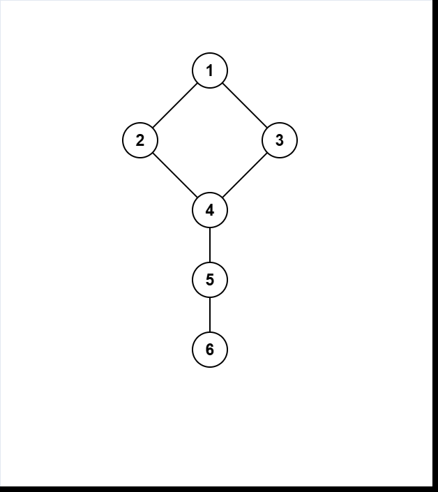
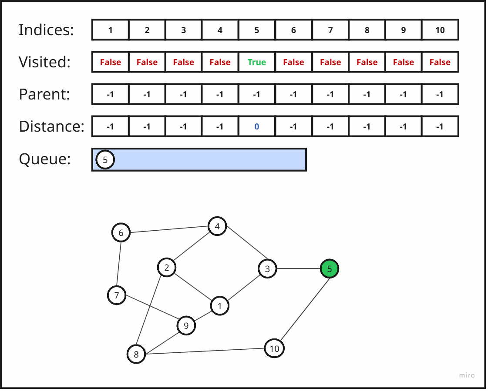

# البحث بالعرض أولاً (BFS)

## المقدمة

يُعتبر **البحث بالعرض أولاً (Breadth-First Search - BFS)** من أكثر **خوارزميات استكشاف** الرسم البياني (graph searching algorithms) أساسيةً. يستكشف BFS الرسم البياني في “دوائر” (rings) ذات مسافات متزايدة انطلاقًا من العقدة المصدر (source node) ويضمن أنه عند زيارة كل عقدة لأول مرة، يكون قد وُجد أقصر مسار (path) من المصدر لها من حيث عدد الحواف (edges). يُستخدم هذا الأسلوب في العديد من تطبيقات الشبكات، وحل المتاهات، وتحليل الشبكات الاجتماعية، والمزيد.

---

## وصف الخوارزمية

تأخذ الخوارزمية مدخلات على شكل **رسم بياني غير موزون** (unweighted graph) و العقدة المصدر $s$. يمكن أن يكون الرسم البياني موجهًا (directed) أو غير موجه (undirected)، إذ يتعامل BFS معهما بنفس الطريقة.

يمكن تشبيه BFS بانتشار **الحريق** في الرسم البياني: في الخطوة الصفرية تكون العقدة المصدر $s$ “مشتعلة”. في كل خطوة لاحقة، تُشعل كل عقدة محترقة جيرانها غير المشتعلين. في كل تكرار، تتسع “حلقة النار” بمقدار حافة واحدة.

في الجوهر، يحافظ BFS على جبهة من العقد عند الطبقة الحالية ويستكشفها بترتيب وصولها. باستخدام **قائمة انتظار** (queue) بنمط **FIFO** (First-In First-Out)، يضمن معالجة العقد بترتيب تصاعدي لمسافاتها من المصدر. لا تحافظ بنية أخرى كـ**مكدس** (stack) أو **قائمة ذات أولوية** (priority queue) على هذا الترتيب الطبقي بدون تعقيد إضافي.

**خطوات الخوارزمية:**
1. إنشاء **قائمة انتظار** $q$ لمعالجة العقد بنمط FIFO.  
2. الاحتفاظ بمصفوفة منطقية `[]vis` للدلالة على زيارة كل عقدة.  
3. أولًا، اجعل `vis[s] = True`، `dis[s] = 0`، `par[s] = -1`، ثم ادفع $s$ إلى $q$. وبالنسبة إلى بقية العقد $v$، اجعل `vis[v] = False`.  
4. طالما أن $q$ ليست فارغة:  
   - أخرج العقدة الأمامية $v = q.front()$ ثم `()pop`.  
   - لكل جار $u$ للعقدة $v$، إذا كانت `vis[u] = False`، اجعل `vis[u] = True`، `dis[u] = dis[v] + 1`، `par[u] = v`، ثم ادفع $u$ إلى $q$.  
5. عند إفراغ $q$، تكون كل العقد التي يمكن الوصول إليها قد تمت زيارتها بترتيب أقصر مسار. مصفوفة `[]dis` تحوي المسافات، ومصفوفة `[]par` تساعد في إعادة بناء المسارات.

للرسوم البيانية **الموزونة** (weighted graphs)، يلزم استخدام خوارزميات أقصر مسار مثل Dijkstra أو Bellman–Ford أو Floyd–Warshall؛ إذ إن ضمان أقصر مسار عبر BFS ينطبق فقط على الرسوم البيانية غير الموزونة.

---

## مثال بسيط على الاستكشاف

لنفترض:
```
V = {1,2,3,4,5,6}
E = {(1,2),(1,3),(2,4),(3,4),(4,5),(5,6)}
```

**قائمة الجوار (1-based):**
```plaintext
1: 2, 3
2: 1, 4
3: 1, 4
4: 2, 3, 5
5: 4, 6
6: 5
```

<div align="center">
    
</div>

من المصدر = 1:
- **الخطوة 0**  
  `queue = [1]`  
  `vis = {True, False, False, False, False, False}`  
  `dis = {-1, -1, -1, -1, -1, -1}`
- **الخطوة 1** إخراج 1 ← إضافة 2 و3  
  `queue = [2, 3]`  
  `vis = {True, True, True, False, False, False}`  
  `dis = {-1, 1, 1, -1, -1, -1}`
- **الخطوة 2** إخراج 2 ← إضافة 4  
  `queue = [3, 4]`  
  `vis = {True, True, True, True, False, False}`  
  `dis = {-1, 1, 1, 2, -1, -1}`
- **الخطوة 3** إخراج 3 ← 4 مُسبقًا ← لا تغيير  
  `queue = [4]`
- **الخطوة 4** إخراج 4 ← إضافة 5  
  `queue = [5]`  
  `vis = {True, True, True, True, True, False}`  
  `dis = {-1, 1, 1, 2, 3, -1}`
- **الخطوة 5** إخراج 5 ← إضافة 6  
  `queue = [6]`  
  `vis = {True, True, True, True, True, True}`  
  `dis = {-1, 1, 1, 2, 3, 4}`
- **الخطوة 6** إخراج 6 ← لا جديد  
  `queue = []` ← انتهى

---

## التنفيذ

=== "C++"
```cpp
void bfs(int s, const vector<vector<int>>& adj,
         vector<int>& dis, vector<int>& par) {
    int n = adj.size();
    vector<bool> vis(n+1,false);
    dis.assign(n+1,-1);
    par.assign(n+1,-1);

    queue<int> q;
    vis[s] = true;
    dis[s] = 0;
    q.push(s);

    while (!q.empty()) {
        int v = q.front(); q.pop();
        for (int u : adj[v]) {
            if (!vis[u]) {
                vis[u] = true;
                dis[u] = dis[v] + 1;
                par[u] = v;
                q.push(u);
            }
        }
    }
}
```

=== "Python"
```python
from collections import deque

def bfs(s, adj):
    n = len(adj) - 1
    vis = [False]*(n+1)
    dis = [-1]*(n+1)
    par = [-1]*(n+1)

    q = deque([s])
    vis[s] = True
    dis[s] = 0

    while q:
        v = q.popleft()
        for u in adj[v]:
            if not vis[u]:
                vis[u] = True
                dis[u] = dis[v] + 1
                par[u] = v
                q.append(u)

    return dis, par
```

---

## الشرح المُفصَّل

لنأخذ مثالًا أكبر:
```
V = {1,2,3,4,5,6,7,8,9,10}
E = {(1,2),(1,3),(2,4),(2,8),(3,4),(3,5),(5,10),(4,6),
     (6,7),(7,9),(9,8),(10,8)}
```

التجاور:
```plaintext
1: 2, 3, 9
2: 1, 4, 8
3: 1, 4, 5
4: 2, 3, 6
5: 3, 10
6: 4, 7
7: 6, 9
8: 2, 9, 10
9: 1, 8
10: 5, 8
```
<div align="center">
    
</div>
---

## التعقيد الزمني

يزور BFS كل عقدة (`vis[v]`) مرة واحدة ويضيفها مرة واحدة إلى قائمة الانتظار. كما يفحص كل حافة في القوائم المرتبطة مرة واحدة فقط. بالتالي، الزمن الكلي للخوارزمية هو $O(|V| + |E|)$. تتضمن مساحة الذاكرة مصفوفات `vis` و`dis` و`par` وقائمة الانتظار، بما يصل إلى $O(|V|)$.

---

## تطبيقات BFS

يُستخدم BFS عندما تحتاج لاستكشاف رسم بياني غير موزون طبقيًا. من الأمثلة الشائعة:

- **أقصر مسار في الرسوم البيانية غير الموزونة (Shortest Path in Unweighted Graphs)**  
  بما أن تكلفة كل حافة (edge) متساوية، يضمن توسُّع BFS على شكل “حلقات” أنه في أول مرة يتم فيها الوصول إلى أي عقدة، يكون ذلك عبر مسار بأقل عدد من الحواف. على سبيل المثال، يعدُّ إيجاد أسرع طريق عبر متاهة (grid)، حيث تكلفة الانتقال في أي اتجاه ثابتة، تطبيقًا مباشرًا لـ BFS.

- **المركبات المتصلة (Connected Components)**  
  في رسم بياني غير موجه، يمكنك إيجاد جميع المركبات المتصلة في زمن $O(n + m)$ عن طريق تشغيل BFS من كل رأس (vertex) لم تتم زيارته بعد، دون إعادة تهيئة مصفوفة `vis[]` بين الجولات. هذه “سلسلة من عمليات BFS” تميز كل رأس مرة واحدة تمامًا.

- **تعبئة المنطقة (Flood Fill)**  
  عندما تحتاج إلى تلوين أو معالجة كافة الخلايا (cells) في منطقة معينة (مثل تلوين جزء في صورة)، ينتشر BFS من خلية البداية إلى جميع الخلايا المتصلة من نفس النوع.

- **أقل عدد من الحركات في فضاء الحالات (Minimum Moves in State Spaces)**  
  نمذجة كل حالة في اللعبة (مثل ترتيب قطع لغز الانزلاق أو موقع الفارس على رقعة الشطرنج) كرأس (vertex)، وتحويلات الحالة الصالحة كحواف. عندها يجد BFS أقل عدد من الحركات للوصول إلى الحالة المستهدفة.

- **0-1 BFS (الرسوم البيانية الموزونة بوزن 0 أو 1)**  
  إذا كانت الحواف لها أوزان 0 أو 1، يمكن تعديل BFS باستخدام قائمة ذات نهاية مزدوجة (deque) لإيجاد أقصر المسارات في زمن $O(n + m)$ عن طريق دفع الحواف ذات الوزن 0 إلى الأمام وتلك ذات الوزن 1 إلى الخلف.

- **أقصر دورة في الرسوم البيانية الموجهة غير الموزونة (Shortest Cycle in Directed Unweighted Graphs)**  
  ابدأ BFS من كل رأس؛ وعند أول مرة تعود فيها إلى المصدر عبر مسار مختلف، تكون قد وجدت أقصر دورة تمر عبر هذا المصدر. كرر العملية لجميع المصادر واختر الدورة الأقصر.
---

## BFS متعدد المصادر

في بعض الحالات، تريد المسافة لأقرب مصدر من بين عدة مصادر. يبدأ BFS متعدد المصادر بدفع جميع المصادر إلى قائمة الانتظار بمسافة 0 ثم ينفذ مرة واحدة:

```plaintext
المصادر: {2, 5}
V = {1,2,3,4,5,6}
E = {(1,2),(1,3),(2,4),(3,5),(4,6),(5,6)}
```

<div align="center">
    
</div>

```plaintext
1: 2,3
2: 1,4
3: 1,5
4: 2,6
5: 3,6
6: 4,5
```

- **التهيئة**: `q=[2,5]`, `vis[2]=vis[5]=True`, `dis[2]=dis[5]=0`.  
- **الخطوة 1**: إخراج 2 ← إضافة 1،4 ← `q=[5,1,4]`, `dis[1]=1`, `dis[4]=1`.  
- **الخطوة 2**: إخراج 5 ← إضافة 3،6 ← `q=[1,4,3,6]`, `dis[3]=1`, `dis[6]=1`.  
- تكملة حتى الانتهاء.

النتيجة النهائية:
```plaintext
dis = {-1, 1, 0, 1, 1, 0, 1}
```

بذلك تقوم تقنية البحث بعرض متعدد المصادر (Multi-source BFS) بحساب الحدّ الأدنى للمسافة من كل رأس (vertex) إلى أقرب مصدر لها في تمريرة واحدة.
