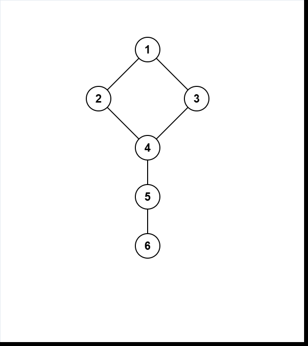
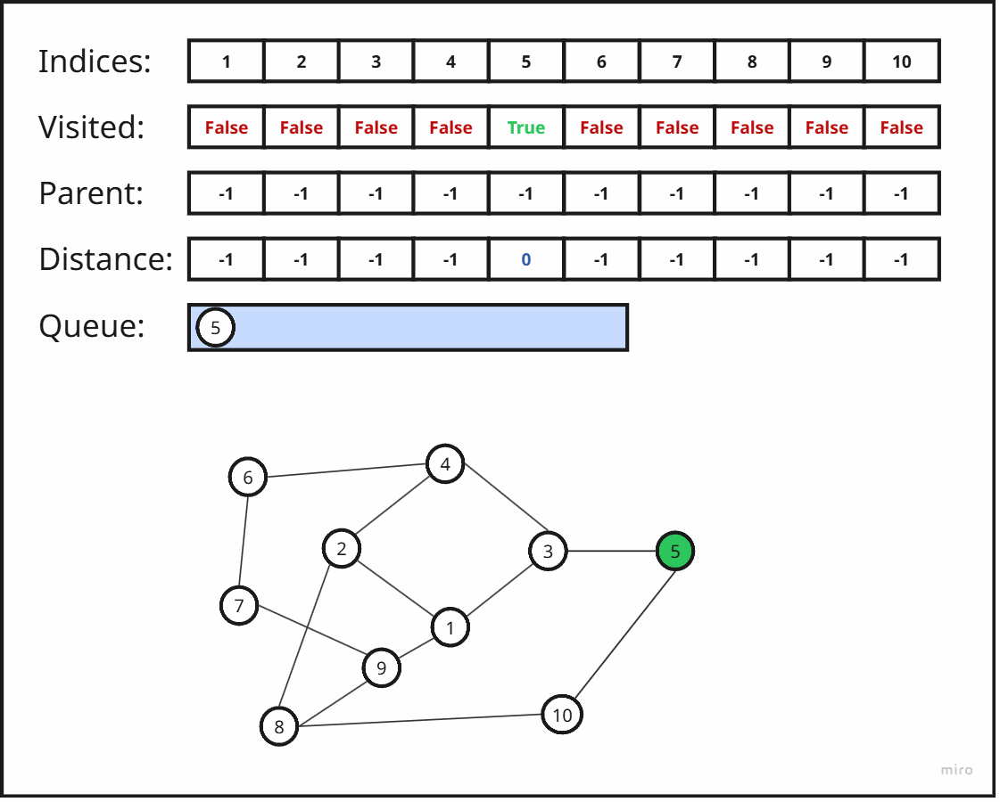
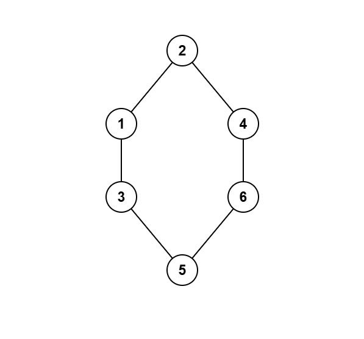

# Breadth-First Search (BFS)

## Introduction

Breadth-First Search (BFS) is one of the most fundamental graph traversal algorithms. It explores a graph in “rings” of increasing distance from a starting node, guaranteeing that when a vertex is first visited, you have found the shortest path (by number of edges) from the source. It underpins many algorithms in networking, maze solving, social network analysis, and more.

---

## Description of the Algorithm

The algorithm takes as input an unweighted graph and the identifier of the source vertex $s$. The input graph can be directed or undirected—BFS treats both the same.

BFS can be understood as a fire spreading on the graph: at time step 0 only the source $s$ is “on fire.” At each subsequent step, every burning vertex ignites all of its unlit neighbors. In each iteration, the “ring of fire” expands by one edge‐length.

At its core, BFS maintains a frontier of vertices at the current distance layer and explores them in order of arrival. By using a queue—a first-in, first-out (FIFO) structure—it guarantees that vertices are processed in the exact order of increasing distance from the source. No other standard container (like a stack or priority queue) naturally preserves this layer-by-layer exploration without additional overhead.

More precisely:
1. Create a queue $q$ to process vertices in FIFO order.
2. Maintain a Boolean array `vis[]` indicating whether each vertex has been visited.
3. Initially, set `vis[s] = true`, `dis[s] = 0`, `par[s] = -1`, push $s$ into $q$. For all other vertices $v$, set `vis[v] = false`.
4. While $q$ is not empty:
   - Pop the front vertex $v = q.front()$, remove it.
   - For each neighbor $u$ of $v$, if `vis[u]` is false, set `vis[u]=true`, `dis[u]=dis[v]+1`, `par[u]=v`, and push $u$ into $q$.
5. When $q$ empties, every reachable vertex has been visited in shortest‐path order. Arrays `dis[]` contain distances, and `par[]` can be used to reconstruct paths.

For weighted graphs, shortest‐path algorithms like Dijkstra, Bellman–Ford, or Floyd–Warshall are needed; BFS’s shortest‐path guarantee holds only for unweighted graphs.

---

## Simple Traversal Example

Consider:
```
V = {1,2,3,4,5,6}
E = {(1,2),(1,3),(2,4),(3,4),(4,5),(5,6)}
```

Adjacency list (1-based):
```plaintext
1: 2, 3
2: 1, 4
3: 1, 4
4: 2, 3, 5
5: 4, 6
6: 5
```

<div align="center">
    
</div>

Starting from source = 1:
- **Step 0**  
  `queue = [1]`  
  `vis = {True, False, False, False, False, False}`  
  `dis = {-1, -1, -1, -1, -1, -1}`
- **Step 1** pop 1 → enqueue 2, 3  
  `queue = [2, 3]`  
  `vis = {True, True, True, False, False, False}`
  `dis = {-1, 1, 1, -1, -1, -1}`
- **Step 2** pop 2 → enqueue 4  
  `queue = [3, 4]`  
  `vis = {True, True, True, True, False, False}`  
  `dis = {-1, 1, 1, 2, -1, -1}`
- **Step 3** pop 3 → 4 already visited → no change  
  `queue = [4]`
- **Step 4** pop 4 → enqueue 5  
  `queue = [5]`  
  `vis = {True, True, True, True, True, False}`  
  `dis = {-1, 1, 1, 2, 3, -1}`
- **Step 5** pop 5 → enqueue 6  
  `queue = [6]`  
  `vis = {True, True, True, True, True, True}`  
  `dis = {-1, 1, 1, 2, 3, 4}`
- **Step 6** pop 6 → no new  
  `queue = [] → done`

At the end, BFS has visited all vertices in order of increasing distance from 1.

---

## Implementation

=== "C++"
```cpp
void bfs(int s, const vector<vector<int>>& adj,
         vector<int>& dis, vector<int>& par) {
    int n = adj.size();
    vector<bool> vis(n+1,false);
    dis.assign(n+1,-1);
    par.assign(n+1,-1);

    queue<int> q;
    vis[s] = true;
    dis[s] = 0;
    q.push(s);

    while (!q.empty()) {
        int v = q.front(); q.pop();
        for (int u : adj[v]) {
            if (!vis[u]) {
                vis[u] = true;
                dis[u] = dis[v] + 1;
                par[u] = v;
                q.push(u);
            }
        }
    }
}
```

=== "Python"
```python
from collections import deque

def bfs(s, adj):
    n = len(adj) - 1
    vis = [False]*(n+1)
    dis = [-1]*(n+1)
    par = [-1]*(n+1)

    q = deque([s])
    vis[s] = True
    dis[s] = 0

    while q:
        v = q.popleft()
        for u in adj[v]:
            if not vis[u]:
                vis[u] = True
                dis[u] = dis[v] + 1
                par[u] = v
                q.append(u)

    return dis, par
```

---

## Detailed Walkthrough

Consider:
```
V = {1,2,3,4,5,6,7,8,9,10}
E = {(1,2),(1,3),(2,4),(2,8),(3,4),(3,5),(5,10),(4,6),
     (6,7),(7,9),(9,8),(10,8)}
```


Adjacency:
```plaintext
1: 2, 3, 9
2: 1, 4, 8
3: 1, 4, 5
4: 2, 3, 6
5: 3, 10
6: 4, 7
7: 6, 9
8: 2, 9, 10
9: 1, 8
10: 5, 8
```
<div align="center">
    
</div>
---

## Time Complexity

BFS marks each vertex `vis[v]` exactly once and enqueues it once. Each edge in the adjacency lists is examined exactly one time during these enqueue operations. Thus, the total running time is $O(|V| + |E|)$. Space usage includes the `vis`, `dis`, `par` arrays and the queue, each requiring $O(|V|)$ memory.

---

## Applications of BFS

BFS shines whenever you need to explore an unweighted graph layer by layer. Common uses include:

- **Shortest Path in Unweighted Graphs**  
  Since each edge has equal cost, BFS’s ring-by-ring expansion guarantees that the first time a node is reached, it is via a minimum‑edge path. For instance, finding the quickest route through a maze (grid), where moving in any direction costs the same, is a direct BFS application.

- **Connected Components**  
  In an undirected graph, you can find all connected components in $O(n + m)$ time by running BFS from each unvisited vertex and never resetting the `vis[]` array between runs. This “series of BFS” marks every vertex exactly once.

- **Flood Fill**  
  When you need to mark or process all cells of a particular region (e.g., coloring an area in an image), BFS propagates outwards from a seed cell to all connected cells of the same type.

- **Minimum Moves in State Spaces**  
  Model each game state (e.g., sliding puzzle configuration, knight’s position on a chessboard) as a vertex, and valid moves as edges. BFS then finds the fewest moves to reach a target state.

- **0-1 BFS (Weighted 0/1 Graphs)**  
  If edges have weights 0 or 1, a modified BFS using a deque can find shortest paths in $O(n + m)$ by pushing zero‑weight edges to the front and one‑weight edges to the back.

- **Shortest Cycle in Directed Unweighted Graphs**  
  Start BFS from each vertex; the first time you see the source again via a different path, you have found the shortest cycle through it. Repeat for all sources and pick the smallest.

---

## Multi-Source BFS

Sometimes you need distances from the **nearest** among several sources. Multi-source BFS initializes the queue with *all* source vertices at distance 0 and runs BFS once:

```plaintext
Sources: {2, 5}
Graph: 
V = {1,2,3,4,5,6}
E = {(1,2),(1,3),(2,4),(3,5),(4,6),(5,6)}
```

<div align="center">
    
</div>


Adjacency:
```plaintext
1: 2,3
2: 1,4
3: 1,5
4: 2,6
5: 3,6
6: 4,5
```

- **Initialize:** `q=[2,5], vis[2]=vis[5]=True, dis[2]=dis[5]=0`.
- **Step 1:** pop 2 → enqueue 1,4 →`q=[5,1,4], dis[1]=1,dis[4]=1, q=[5,1,4]`.
- **Step 2:** pop 5 → enqueue 3,6 → `q=[1,4,3,6], dis[3]=1, dis[6]=1, q=[1,4,3,6]`.
- Continue popping, but all neighbors of 1,4,3,6 already visited ⇒ BFS ends.

Final distances:
```plaintext
dis = {-1, 1, 0, 1, 1, 0, 1}
```

Multi-source BFS thus computes in one pass the minimum distance from each vertex to its nearest source.