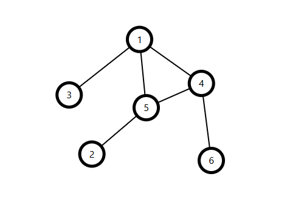
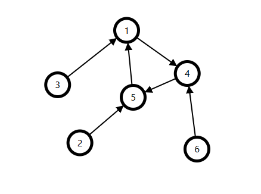
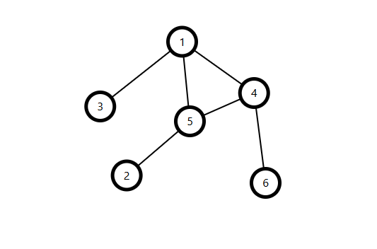
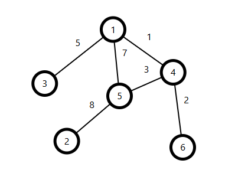
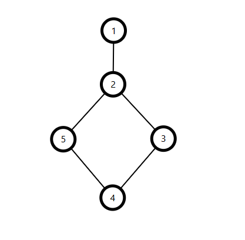
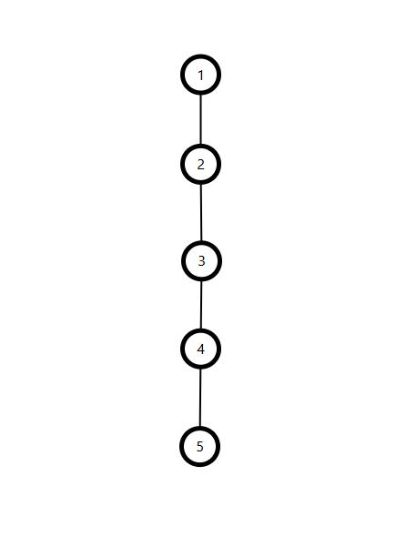
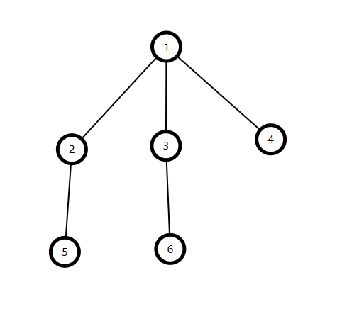
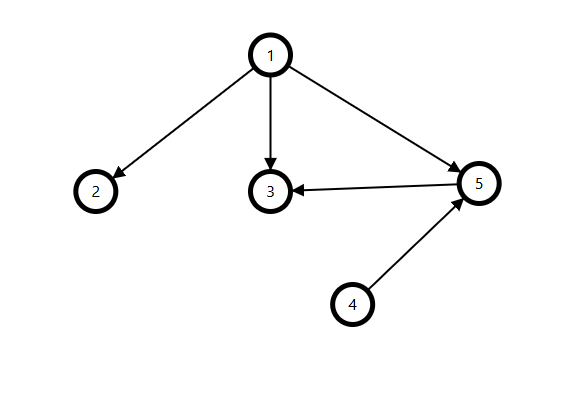
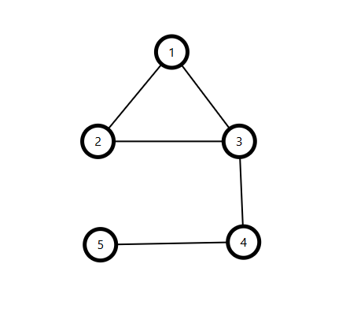
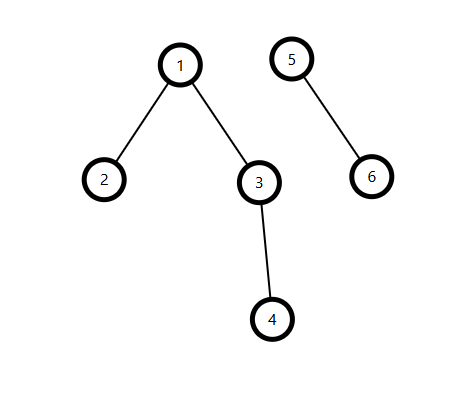

# مقدمة في الرسم البياني

## التعريف

**الرسم البياني (Graph)** هو هيكل بيانات يتكون من مجموعة من **العقد (nodes)** ومجموعة من **الحواف (edges)** التي تربط بينها. تُستخدم الرسوم البيانية في البرمجة التنافسية لحل مشكلات مثل الاتصال (connectivity)، أقصر مسار (shortest paths)، الدورات (cycles)، والمركبات (components).

---

## المفهوم الرئيسي

* يحتوي الرسم البياني $G = (V, E)$ على:
  * **$V$**: مجموعة من **الرؤوس (vertices)**  
  * **$E$**: مجموعة من **الحواف (edges)** التي تربط أزواجَ الرؤوس  
* يمكن أن تكون الحواف **موجهة (directed)** أو **غير موجهة (undirected)**  
* يمكن أن تكون الحواف **موزونة (weighted)** أو **غير موزونة (unweighted)**  
* تشمل الأنواع الشائعة **الشجرة (tree)** و**الرسم البياني الموجه غير الدوري (DAG)**  
* يتم تمثيل الرسوم البيانية باستخدام **قائمة الجوار (adjacency list)** أو **مصفوفة الجوار (adjacency matrix)**  

---

## المصطلحات

| المصطلح                         | المعنى                                                                 |
|---------------------------------|------------------------------------------------------------------------|
| الرأس (vertex)                  | نقطة أو عنصر في الرسم البياني                                          |
| العقدة (node)                   | نفس معنى الرأس (vertex)                                                |
| الحافة (edge)                   | اتصال بين رأسين                                                        |
| متجاور (adjacent)               | أن يكون هناك حافة بين رأسين                                            |
| الدرجة (degree)                 | عدد الحواف المتصلة برأس معين                                           |
| المسار (path)                   | تسلسل من الرؤوس متصلة بحواف                                            |
| الدورة (cycle)                  | مسار يبدأ وينتهي عند نفس الرأس                                          |
| الرسم البياني المرتبط (connected graph)     | كل رأس يمكن الوصول إليه من أي رأس آخر                          |
| الرسم البياني غير المرتبط (disconnected graph) | يوجد على الأقل رأس واحد لا يمكن الوصول إليه من آخر         |
| الشجرة (tree)                   | رسم بياني غير موجه، مرتبط، وغير دوري يحتوي على $n-1$ حافة لـ $n$ رؤوس |
| DAG (directed acyclic graph)    | رسم بياني موجه وغير دوري                                                |

---

## أنواع الرسوم البيانية

1. **الرسم البياني غير الموجه (Undirected Graph)**  
   الحواف ليس لها اتجاه — $(u, v) = (v, u)$  
   <div align="center">
       
   </div>

2. **الرسم البياني الموجه (Directed Graph)**  
   للحواف اتجاه — $(u, v) \neq (v, u)$  
   <div align="center">
       
   </div>

3. **الرسم البياني غير الموزون (Unweighted Graph)**  
   جميع الحواف تُعتبر متساوية (الوزن = 1)  
   <div align="center">
       
   </div>

4. **الرسم البياني الموزون (Weighted Graph)**  
   كل حافة لها تكلفة أو وزن  
   <div align="center">
       
   </div>

5. **الرسم البياني الدوري (Cyclic Graph)**  
   يحتوي على دورة واحدة على الأقل  
   <div align="center">
       
   </div>

6. **الرسم البياني غير الدوري (Acyclic Graph)**  
   لا يحتوي على دورات  
   <div align="center">
       
   </div>

7. **الشجرة (Tree)**  
   رسم بياني غير موجه، مرتبط، وغير دوري به $n$ رؤوس و $n-1$ حافات  
   <div align="center">
       
   </div>

8. **الرسم البياني الموجه غير الدوري (DAG)**  
   رسم بياني موجه ولا يحتوي على دورات  
   <div align="center">
       
   </div>

9. **الرسم البياني المرتبط (Connected Graph)**  
   كل رأس يمكن الوصول إليه من أي رأس آخر  
   <div align="center">
       
   </div>

10. **الرسم البياني غير المرتبط (Disconnected Graph)**  
    يوجد على الأقل رأس واحد لا يمكن الوصول إليه من آخر  
   <div align="center">
       
   </div>

---

## قائمة الجوار (Adjacency List)

- تخزن قائمة الجيران لكل رأس  
- فعّالة للرسم البياني **المتناثر (sparse)**  
- **التعقيد الزمني لإنشاء القائمة**: $O(n + m)$  
- **التعقيد الزمني لفحص وجود حافة**: $O(\text{degree})$  

=== "c++"
```c++
vector<vector<int>> adj(n);
adj[u].push_back(v);
adj[v].push_back(u);  // if undirected
```

=== "Python"
```python
adj = [[] for _ in range(n)]
adj[u].append(v)
adj[v].append(u)  # if undirected
```

## مصفوفة الجوار (Adjacency Matrix)

- مصفوفة ثنائية الأبعاد بحجم $n \times n$  
- $adj[u][v] = 1$ يعني وجود حافة من الرأس $u$ إلى الرأس $v$  
- مناسبة للرسوم **الكثيفة (dense)**  
- **التعقيد الزمني لفحص وجود حافة**: $O(1)$  
- **التعقيد الفراغي**: $O(n^2)$  
- سريع وبسيط في الفحص، لكن غير فعّال لمساحات كبيرة ونادرة  

=== "c++"
```c++
vector<vector<int>> adj(n, vector<int>(n, 0));
adj[u][v] = 1;
adj[v][u] = 1;  // if undirected
```

=== "Python"
```python
adj = [[0] * n for _ in range(n)]
adj[u][v] = 1
adj[v][u] = 1  # if undirected
```
---

## تجوال الرسم البياني

يشير تجوال الرسم البياني إلى التقنيات المستخدمة لزيارة جميع العقد (nodes) في الرسم، تمامًا مثل التكرار على مصفوفة أو متجه (vector). طريقتان أساسيتان هما **البحث بالعمق أولاً (DFS)**، الذي يستخدم المكدس (stack) أو العودية (recursion) لاستكشاف الفروع لأقصى حد ممكن، و**البحث بالعرض أولاً (BFS)**، الذي يستخدم قائمة الانتظار (queue) لاستكشاف الجيران على مستويات متعاقبة. سنغطي هذين الخوارزميتين بالتفصيل في التدوينات القادمة.
