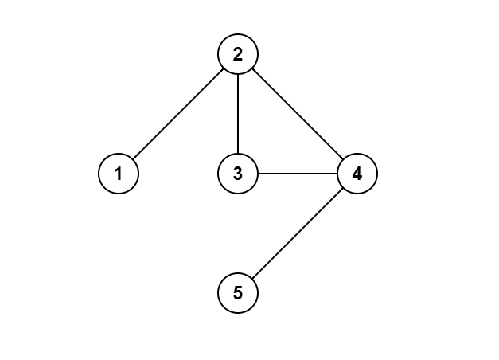
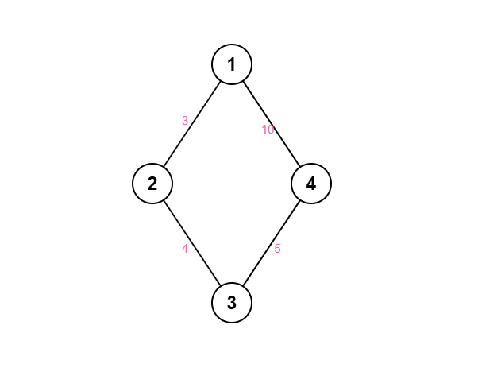
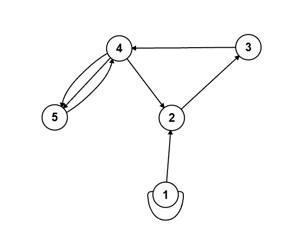

# مقدمة في الرسم البياني

## التعريف

**الرسم البياني** $G = (V, E)$ هو مجموعة من **الرؤوس** (العقد) $V$ و**الحواف** $E$ التي تربط بين أزواج الرؤوس. العديد من مسائل المسابقات—من نمذجة الشبكات الاجتماعية للأصدقاء إلى رسم خرائط المدن والطرق، ومن جدولة المهام ذات المتطلبات المسبقة إلى تصفح الويب—تدور حول أسئلة متعلقة بالرسوم البيانية.

قبل الخوض في التفاصيل، لاحظ أن الرسوم البيانية تُصنف حسب نوع الحواف: **موجهة** مقابل **غير موجهة**، و**الموزونة** مقابل **غير الموزونة**. هذه الفروق تحدد البنى الخاصة (الأشجار، الرسم البياني الموجه غير الدوري DAG، الدورات) والتقنيات المناسبة (البحث بعرض المستوى BFS، الفرز التوبولوجي، الاتحاد-البحث union-find، وخوارزميات المكونات القوية SCC).

---

## المصطلحات

### المصطلحات العامة

| المصطلح            | التعريف                                                                                   |
|--------------------|-------------------------------------------------------------------------------------------|
| **الرأس** (Vertex) | نقطة أو عنصر في الرسم البياني                                                             |
| **الحافة** (Edge)  | رابط يربط بين رأسين                                                                       |
| **الحلقة الذاتية** (Self-loop) | حافة $(u,u)$ تبدأ وتنتهي عند نفس الرأس                                         |
| **الحواف المتعددة** (Multi-edge) | أكثر من حافة بين نفس الزوج من الرؤوس                                            |
| **الرسم الفرعي** (Subgraph) | رسم بياني يتكون من مجموعة فرعية من الرؤوس والحواف من الرسم الأصلي                  |
| **المسار** (Path)  | تسلسل من الرؤوس حيث كل زوج متتابع متصل بحافة                                            |
| **مسار بسيط** (Simple Path) | مسار لا يتكرر فيه أي رأس                                                              |
| **الدورة** (Cycle) | مسار يبدأ وينتهي عند نفس الرأس                                                           |
| **دورة بسيطة** (Simple Cycle) | دورة لا يتكرر فيها أي رأس (باستثناء الرأس الأول/الأخير)                           |
| **غير دوري** (Acyclic) | رسم بياني خالٍ من الدورات                                                              |
| **دوري** (Cyclic)  | رسم بياني يحتوي على دورة واحدة على الأقل                                                  |
| **مكون** (Component) | مجموعة من الرؤوس يرتبط أي رأسين فيها بمسار                                              |

### خاص بالرسوم غير الموجهة

| المصطلح                          | التعريف                                                    |
|----------------------------------|-------------------------------------------------------------|
| **الدرجة** (Degree)              | عدد الحواف المرتبطة برأس معين                                |
| **المكون المتصل** (Connected Component) | مجموعة قصوى من الرؤوس بحيث يوجد مسار بين أي رأسين      |
| **الرسم المتصل** (Connected Graph) | رسم بياني غير موجه يحتوي على مكون متصل واحد فقط           |
| **الشجرة** (Tree)                | رسم بياني غير موجه، خالٍ من الدورات، له $|V|-1$ حافة       |

### خاص بالرسوم الموجهة

| المصطلح                                  | التعريف                                                                      |
|------------------------------------------|-------------------------------------------------------------------------------|
| **الدرجة الداخلة** (In-degree)           | عدد الحواف الواردة إلى رأس معين                                                |
| **الدرجة الخارجة** (Out-degree)          | عدد الحواف الصادرة من رأس معين                                                 |
| **الرسم الموجه غير الدوري** (DAG)        | رسم بياني موجه خالٍ من الدورات                                                 |
| **المكون القوي** (Strongly Connected Component) | مجموعة قصوى من الرؤوس يصل كل منها إلى الآخر عبر حواف موجهة               |
| **إمكانية الوصول** (Reachability)         | وجود مسار موجه من رأس إلى آخر                                                   |

---

---

## أنواع الرسوم البيانية

هناك عدة أنواع أساسية للرسوم البيانية، تُعرف بناءً على اتجاه الحواف ووزنها أو بُنيها الخاصة:

- **الرسم غير الموجه** (Undirected Graph): حواف بدون اتجاه — $(u, v) = (v, u)$.  
- **الرسم الموجه** (Directed Graph / Digraph): حواف لها اتجاه — $(u, v) \neq (v, u)$.  
- **غير موزون** (Unweighted Graph): جميع الحواف متساوية (الوزن = 1).  
- **موزون** (Weighted Graph): كل حافة لها تكلفة أو وزن.  
- **رسوم دورية** (Cyclic Graph): تحتوي على دورة واحدة على الأقل.  
- **رسوم غير دورية** (Acyclic Graph): خالية من الدورات.  
- **شجرة** (Tree): رسم غير موجه، خالٍ من الدورات، له $n$ رؤوس و$n-1$ حافة.  
- **رسم موجه غير دوري** (DAG): رسم موجه خالٍ من الدورات.  
- **رسم متصل** (Connected Graph): رسم غير موجه له مكون متصل واحد.  
- **رسم منفصل** (Disconnected Graph): رسم غير موجه له أكثر من مكون متصل.

---

## كيفية تمثيل الرسم البياني

هناك طريقتان رئيسيتان لتمثيل الرسوم البيانية: **قائمة الجوار** و**مصفوفة الجوار**.  
- **قائمة الجوار** (Adjacency List): تستخدم قائمة أو مصفوفة لكل رأس لتخزين جيرانه. فعّالة للرسوم المتناثرة وتوفّر الذاكرة.  
- **مصفوفة الجوار** (Adjacency Matrix): تستخدم مصفوفة ثنائية الأبعاد بحجم $n	imes n$، حيث تكون الخلية في الصف $i$ والعمود $j$ تساوي 1 إذا وُجدت حافة من $i$ إلى $j$، و0 خلاف ذلك. سريع لفحص وجود الحافة، لكنه يستخدم ذاكرة أكبر للرسوم الكثيفة.

---

## خصائص الشجرة

**الشجرة** هي رسم غير موجه، خالٍ من الدورات، وله $n-1$ حافة على $n$ رؤوس. نختار غالبًا رأسًا واحدًا كـ*جذر* لمناقشة:

- **عمق** الرأس هو عدد الحواف من الجذر إليه.  
- **ارتفاع** الشجرة هو أكبر عمق بين الرؤوس.  
- **القطر** هو أطول مسار بسيط بين أي رأسين في الشجرة.

---

## أمثلة

### المثال 1: غير موجه غير موزون (مسارات، دورات ودرجات)

هذا هو الرسم  
$G = (V, E), \quad V = \{1,2,3,4,5\}, \quad E = \{(1,1), (1,2), (1,2), (2,3), (2,4), (3,5)\}.$

<div align="center">
    
</div>

هذا رسم **غير موجه** و**غير موزون** يحتوي على حلقة ذاتية في 1 وحافتين بين 1 و2.

- **المسار:** 1 → 2 → 3 → 5  
- **مسار بسيط:** 4 → 2 → 3  
- **دورة:** 2 → 3 → 5 → 3 → 2  
- **دورة بسيطة:** 1 → 2 → 4 → 1  

**الدرجات** (الحلقة الذاتية تحسب مرتين عند 1):  
- درجة(1) = 4  
- درجة(2) = 4  
- درجة(3) = 2  
- درجة(4) = 1  
- درجة(5) = 1  

---

### المثال 2: شجرة (عمق، ارتفاع، قطر)

هذا هو الرسم  
$G = (V, E), \quad V = \{1,2,3,4,5\}, \quad E = \{(1,2), (1,3), (2,4), (2,5)\}.$

<div align="center">
    
</div>

هذه **شجرة** غير موجه وخالية من الدورات، نجذر في 1:

- الأعماق: 1(0)، 2(1)، 3(1)، 4(2)، 5(2)  
- الارتفاع: 2  
- القطر: 3 (مثال المسار 4–2–1–3)  

---

### المثال 3: رسم منفصل ومكوناته

هذا هو الرسم  
$G = (V, E), \quad V = \{1,2,3,4,5,6\}, \quad E = \{(1,2), (2,3), (4,5)\}.$

<div align="center">
    
</div>

هذا رسم **غير موجه** و**غير موزون** **منفصل** إلى:

1. {1,2,3}  
2. {4,5}  
3. {6}  

---

### المثال 4: موزون غير موجه (تكلفة المسار)

هذا هو الرسم  
$G = (V, E), \quad V = \{1,2,3,4\}, \quad E = \{(1,2,3), (2,3,4), (3,4,5), (1,4,10)\}.$

<div align="center">
    
</div>

هذا رسم **موزون** و**غير موجه**:

- المسار 1→4 عبر 1–2–3–4: التكلفة 3+4+5 = 12  
- المسار المباشر 1→4: التكلفة 10  

الطريق المباشر أرخص (10 مقابل 12).

---

### المثال 5: موجه غير موزون (مسارات، دورات ودرجات)

هذا هو الرسم  
$G = (V, E), \quad V = \{1,2,3,4,5\}, \quad E = \{(1,1), (1,2), (2,3), (3,4), (4,2), (4,5), (4,5), (5,4)\}.$

<div align="center">
    
</div>

هذا رسم **موجه** و**غير موزون** يحتوي حلقة ذاتية وحافتين موازيتين.

- **المسار:** 1 → 2 → 3 → 4 → 5 → 4  
- **المسار البسيط:** 1 → 2 → 3 → 4 → 5  
- **الدورة:** 2 → 3 → 4 → 2  
- **الدورة البسيطة:** 2 → 3 → 4 → 2  

**الدرجات الداخلة/الخارجة:**  
- 1: داخل=1، خارج=2  
- 2: داخل=2، خارج=1  
- 3: داخل=1، خارج=1  
- 4: داخل=2، خارج=3  
- 5: داخل=2، خارج=1  

---

## قائمة الجوار (Adjacency List)

- تخزن قائمة الجوار جيران كل رأس  
- فعّالة للرسوم المتناثرة ($O(n+m)$ مساحة)  
- فحص وجود حافة: $O(	ext{degree})$  

=== "c++"
```c++
vector<vector<int>> adj(n);
adj[u].push_back(v);
adj[v].push_back(u);  // للرسوم غير الموجهة
```

=== "Python"
```python
adj = [[] for _ in range(n)]
adj[u].append(v)
adj[v].append(u)  # للرسوم غير الموجهة
```

## مصفوفة الجوار (Adjacency Matrix)

- مصفوفة $n 	imes n$ حيث $adj[u][v]=1$ تعني حافة $u
ightarrow v$  
- مناسبة للرسوم الكثيفة ($O(n^2)$ مساحة، $O(1)$ فحص)  

=== "c++"
```c++
vector<vector<int>> adj(n, vector<int>(n,0));
adj[u][v]=1; adj[v][u]=1;  // للرسوم غير الموجهة
```

=== "Python"
```python
adj = [[0]*n for _ in range(n)]
adj[u][v]=1; adj[v][u]=1
```

---

## تجوال الرسم البياني (Graph Traversal)

تجوال الرسم البياني هي التقنيات المستخدمة لزيارة جميع العقد، مثل التكرار على مصفوفة. طريقتان أساسيتان:  
- **البحث بعرض المستوى (BFS)** باستخدام قائمة انتظار  
- **البحث بعمق الأولى (DFS)** باستخدام ستاك أو العودية  

سوف نغطي هذه الخوارزميات بالتفصيل في التدوينات القادمة.
