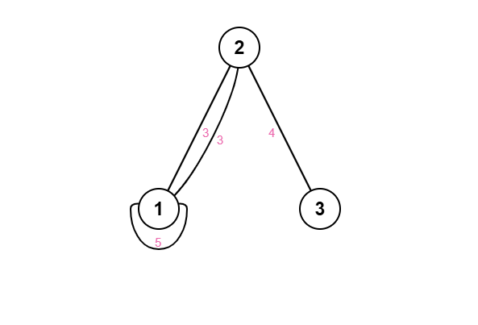
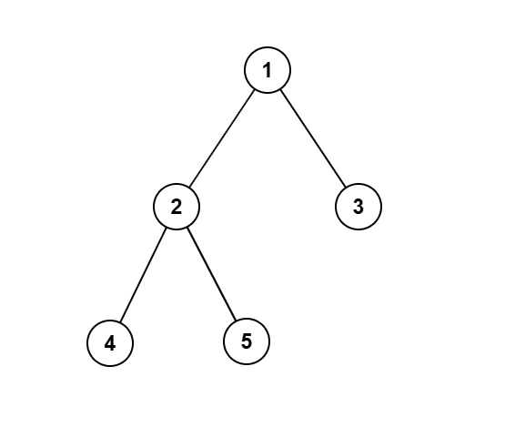
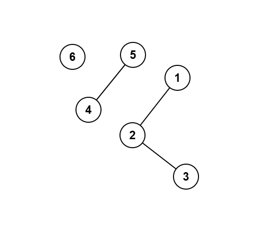
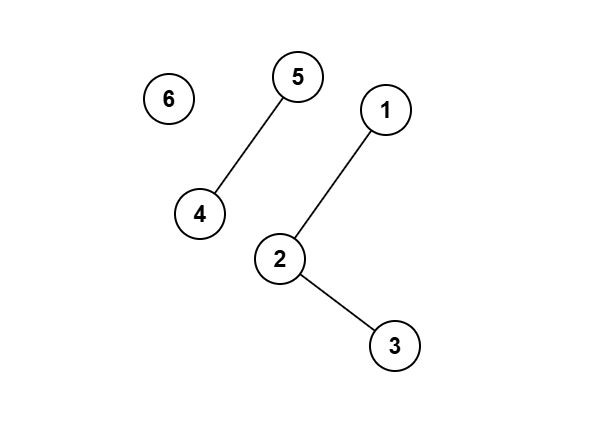
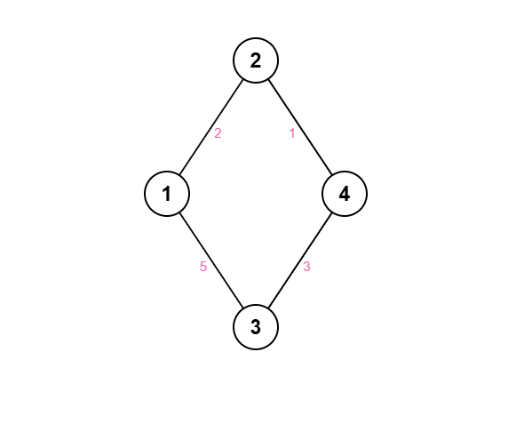

# Introduction to Graph

## Definition

A **graph** $G = (V, E)$ is a collection of **vertices** (nodes) $V$ and **edges** $E$ connecting pairs of vertices. Many contest problems—from modeling social networks of friends to mapping cities and roads, from scheduling tasks with prerequisites to crawling the web—boil down to graph questions.

Before diving into the details, note that graphs fall into categories based on their edges: **directed** vs **undirected**, and **weighted** vs **unweighted**. These distinctions determine which structures (trees, DAGs, cycles) and techniques (BFS, topological sort, union-find, SCC algorithms) apply.

---

## Terminology

### Common Terms

| Term            | Definition                                                                                 |
|-----------------|--------------------------------------------------------------------------------------------|
| **Vertex**      | A node in the graph                                                                        |
| **Edge**        | A connection between two vertices                                                          |
| **Self-loop**   | An edge $(u,u)$ from a vertex back to itself                                              |
| **Multi-edge**  | More than one edge connecting the same pair of vertices                                    |
| **Subgraph**    | A graph formed by selecting a subset of the original vertices and edges                    |
| **Path**        | A sequence of vertices where each consecutive pair is connected by an edge                 |
| **Simple Path** | A path in which no vertex is repeated                                                      |
| **Cycle**       | A path whose first and last vertices are the same                                         |
| **Simple Cycle**| A cycle in which no vertices (except the start/end) are repeated                           |
| **Acyclic**     | A graph with no cycles                                                         |
| **Cyclic**      | A graph that contains at least one cycle                                      |
| **Component**   | A set of vertices in which each pair is connected by some path   

### Undirected-Specific

| Term                    | Definition                                                                     |
|-------------------------|--------------------------------------------------------------------------------|
| **Degree**              | The number of edges incident to a vertex                                       |
| **Connected Component** | A maximal set of vertices where each pair is connected by some path            |
| **Connected Graph**     | An undirected graph with exactly one connected component                       |
| **Tree**                | A connected, acyclic undirected graph with exactly $V - 1$ edges        |

### Directed-Specific

| Term                              | Definition                                                                         |
|-----------------------------------|------------------------------------------------------------------------------------|
| **In-degree**                     | The number of edges entering a vertex                                              |
| **Out-degree**                    | The number of edges leaving a vertex                                               |
| **DAG**                           | Directed Acyclic Graph—no directed cycles                                          |
| **Strongly Connected Component** | A maximal subgraph where each vertex can reach every other via directed paths      |
| **Reachability**                  | The existence of a directed path from one vertex to another                        |

---

---

## Types of Graphs

There are several basic graph types, each defined by edge direction and weight or special structure:

- **Undirected Graph**: Edges have no direction — $(u, v) = (v, u)$.  
- **Directed Graph (Digraph)**: Edges have a direction — $(u, v) \neq (v, u)$.
- **Unweighted Graph**: All edges are considered equal (weight = 1).
- **Weighted Graph**: Each edge has a cost or weight.   
- **Cyclic Graph**: Contains at least one cycle. 
- **Acyclic Graph**: Contains at least one cycle.
- **Tree**: A connected, undirected, acyclic graph with $n$ nodes and $n-1$ edges.  
- **DAG (Directed Acyclic Graph)**: A directed graph with no cycles.
- **Connected Graph**: an undirected graph with exactly one connected component.  
- **Disconnected Graph**: an undirected graph with two or more separate components.

---

## Tree Properties


A **tree** is a special undirected graph with no cycles and exactly $n-1$ edges on $n$ vertices. We often choose one node as the *root* to discuss:

- **Depth** of a vertex is the number of edges from the root down to that vertex.  
- **Height** of the tree is the maximum depth among all vertices.  
- **Diameter** is the longest shortest-path between any two vertices in the tree.

---


## Examples

### Example 1: Undirected Unweighted (Paths, Cycles & Degrees)

This is the input graph  
$G = (V, E), 
V = {1,2,3,4,5}, 
E = {(1,1), (1,2), (1,2), (2,3), (2,4), (3,5)}$

<div align="center">
    
</div>

This is an **undirected**, **unweighted** graph with a self-loop at 1 and a multi-edge between 1 and 2.  

- **Path:** `1 → 2 → 3 → 5`  
- **Simple path:** `4 → 2 → 3`  
- **Cycle:** `2 → 3 → 5 → 3 → 2`  
- **Simple cycle:** `1 → 2 → 4 → 1`  

**Degrees (self-loop counts as 2 at vertex 1):**  
- degree(1) = 4 (self-loop adds 2 + two edges to 2)  
- degree(2) = 4 (two edges from 1 + edges to 3 and 4)  
- degree(3) = 2 (edges to 2 and 5)  
- degree(4) = 1 (edge to 2)  
- degree(5) = 1 (edge to 3)  

---

### Example 2: Tree (Depth, Height & Diameter)

This is the input tree  
$G = (V, E), V = {1,2,3,4,5}, E = {(1,2), (1,3), (2,4), (2,5)}$

<div align="center">
    
</div>

This **undirected**, **acyclic** graph is a tree rooted at 1:

- **Depths:**  
  - depth(1)=0  
  - depth(2)=1, depth(3)=1  
  - depth(4)=2, depth(5)=2  
- **Height:** 2 (maximum depth)  
- **Diameter:** 3 (longest path e.g. `4 – 2 – 1 – 3`)  

---

### Example 3: Disconnected Graph & Components

This is the input graph  
$G = (V, E), V = {1,2,3,4,5,6}, E = {(1,2), (2,3), (4,5)}$

<div align="center">
    
</div>

This **undirected**, **unweighted** graph is **disconnected** into:

1. Component `{1,2,3}` (chain 1–2–3)  
2. Component `{4,5}` (edge 4–5)  
3. Component `{6}` (isolated)  

---

### Example 4: Weighted Undirected (Path Cost)

This is the input graph  
$G = (V, E), V = {1,2,3,4}, E = {(1,2,3), (2,3,4), (3,4,5), (1,4,10)}$

<div align="center">
    
</div>

This **weighted**, **undirected** graph:

- **Path 1→4 via 1–2–3–4:** cost = 3 + 4 + 5 = **12**  
- **Direct path 1→4:** cost = **10**  

Thus the cheaper route is direct (10 vs 12).

---

### Example 5: Directed Unweighted (Paths, Cycles & Degrees)

This is the input graph  
$G = (V, E), V = {1,2,3,4,5}, E = {(1,1), (1,2), (2,3), (3,4), (4,2), (4,5), (4,5), (5,4)}$

<div align="center">
    
</div>

This **directed**, **unweighted** graph has loops and multi-edges:

- **Path:** `1 → 2 → 3 → 4 → 5 → 4`  
- **Simple path:** `1 → 2 → 3 → 4 → 5`  
- **Cycle:** `2 → 3 → 4 → 2`  
- **Simple cycle:** `2 → 3 → 4 → 2`  

**In-degrees / Out-degrees:**  
- 1: in=1, out=2  
- 2: in=2, out=1  
- 3: in=1, out=1  
- 4: in=2, out=3  
- 5: in=2, out=1  

---


## Adjacency List

- Stores a list of neighbors for each node  
- Efficient for **sparse graphs**  
- **Space complexity**: $O(n + m)$  
- **Edge check complexity**: $O(\text{degree})$  


=== "c++"
```c++
vector<vector<int>> adj(n);
adj[u].push_back(v);
adj[v].push_back(u);  // if undirected
```

=== "Python"
```python
adj = [[] for _ in range(n)]
adj[u].append(v)
adj[v].append(u)  # if undirected
```

## Adjacency Matrix

- 2D matrix of size $n \times n$  
- $adj[u][v] = 1$ means there is an edge from node $u$ to node $v$  
- Suitable for **dense graphs**  
- **Space complexity**: $O(n^2)$  
- **Edge check complexity**: $O(1)$  
- Simple and fast lookups  
- Not space-efficient for sparse graphs  

=== "c++"
```c++
vector<vector<int>> adj(n, vector<int>(n, 0));
adj[u][v] = 1;
adj[v][u] = 1;  // if undirected
```

=== "Python"
```python
adj = [[0] * n for _ in range(n)]
adj[u][v] = 1
adj[v][u] = 1  # if undirected
```

---

## Graph Traversal

Graph traversal refers to the techniques used to visit all the nodes in a graph, much like iterating through an array or a vector. Two fundamental methods are **Depth-First Search (DFS)**, which uses a stack or recursion to explore as far as possible along each branch, and **Breadth-First Search (BFS)**, which uses a queue to explore neighbors level by level. We will cover these traversal algorithms in detail in upcoming blog posts.
