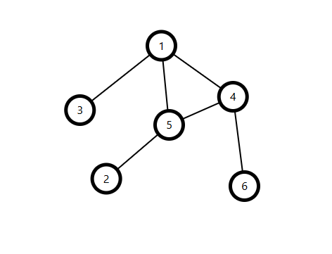

# Introduction to Graph

## Definition

A **graph** $G = (V, E)$ is a collection of **vertices** (nodes) $V$ and **edges** $E$ connecting pairs of vertices. Many contest problems—from modeling social networks of friends to mapping cities and roads, from scheduling tasks with prerequisites to crawling the web—boil down to graph questions. By framing a problem as a graph, you tap into a rich arsenal of concepts and algorithms.

Before diving into the details, note that graphs fall into categories based on their edges: **directed** vs **undirected**, and **weighted** vs **unweighted**. These distinctions determine which structures (trees, DAGs, cycles) and techniques (BFS, topological sort, union-find, SCC algorithms) apply.

---

## Terminology

### Common Terms

| Term            | Definition                                                                                 |
|-----------------|--------------------------------------------------------------------------------------------|
| **Vertex**      | A node in the graph                                                                        |
| **Edge**        | A connection between two vertices                                                          |
| **Self-loop**   | An edge $(u,u)$ from a vertex back to itself                                              |
| **Multi-edge**  | More than one edge connecting the same pair of vertices                                    |
| **Subgraph**    | A graph formed by selecting a subset of the original vertices and edges                    |
| **Path**        | A sequence of vertices where each consecutive pair is connected by an edge                 |
| **Simple Path** | A path in which no vertex is repeated                                                      |
| **Cycle**       | A path whose first and last vertices are the same                                         |
| **Simple Cycle**| A cycle in which no vertices (except the start/end) are repeated                           |

### Undirected-Specific

| Term                    | Definition                                                                     |
|-------------------------|--------------------------------------------------------------------------------|
| **Degree**              | The number of edges incident to a vertex                                       |
| **Connected Component** | A maximal set of vertices where each pair is connected by some path            |
| **Connected Graph**     | An undirected graph with exactly one connected component                       |
| **Tree**                | A connected, acyclic undirected graph with exactly $V - 1$ edges        |

### Directed-Specific

| Term                              | Definition                                                                         |
|-----------------------------------|------------------------------------------------------------------------------------|
| **In-degree**                     | The number of edges entering a vertex                                              |
| **Out-degree**                    | The number of edges leaving a vertex                                               |
| **DAG**                           | Directed Acyclic Graph—no directed cycles                                          |
| **Strongly Connected Component** | A maximal subgraph where each vertex can reach every other via directed paths      |
| **Reachability**                  | The existence of a directed path from one vertex to another                        |

---

## Types of Graphs

1. **Undirected Graph**  
   Edges have no direction — $(u, v) = (v, u)$  
   <div align="center">
       
   </div>

2. **Directed Graph (Digraph)**  
   Edges have a direction — $(u, v) \neq (v, u)$  
   <div align="center">
       
   </div>

3. **Unweighted Graph**  
   All edges are considered equal (weight = 1)  
   <div align="center">
       
   </div>

4. **Weighted Graph**  
   Each edge has a cost or weight  
   <div align="center">
       
   </div>

5. **Cyclic Graph**  
   Contains at least one cycle  
   <div align="center">
       
   </div>

6. **Acyclic Graph**  
   Contains no cycles  
   <div align="center">
       
   </div>

7. **Tree**  
   A connected, undirected, acyclic graph with $n$ nodes and $n-1$ edges  
   <div align="center">
       
   </div>

8. **DAG (Directed Acyclic Graph)**  
   A directed graph with no cycles  
   <div align="center">
       
   </div>

9. **Connected Graph**  
   Every vertex is reachable from every other vertex  
   <div align="center">
       
   </div>

10. **Disconnected Graph**  
    At least one vertex is not reachable from others  
   <div align="center">
       
   </div>

---

## Adjacency List

- Stores a list of neighbors for each node  
- Efficient for **sparse graphs**  
- **Space complexity**: $O(n + m)$  
- **Edge check complexity**: $O(\text{degree})$  


=== "c++"
```c++
vector<vector<int>> adj(n);
adj[u].push_back(v);
adj[v].push_back(u);  // if undirected
```

=== "Python"
```python
adj = [[] for _ in range(n)]
adj[u].append(v)
adj[v].append(u)  # if undirected
```

## Adjacency Matrix

- 2D matrix of size $n \times n$  
- $adj[u][v] = 1$ means there is an edge from node $u$ to node $v$  
- Suitable for **dense graphs**  
- **Space complexity**: $O(n^2)$  
- **Edge check complexity**: $O(1)$  
- Simple and fast lookups  
- Not space-efficient for sparse graphs  

=== "c++"
```c++
vector<vector<int>> adj(n, vector<int>(n, 0));
adj[u][v] = 1;
adj[v][u] = 1;  // if undirected
```

=== "Python"
```python
adj = [[0] * n for _ in range(n)]
adj[u][v] = 1
adj[v][u] = 1  # if undirected
```

---

## Graph Traversal

Graph traversal refers to the techniques used to visit all the nodes in a graph, much like iterating through an array or a vector. Two fundamental methods are **Depth-First Search (DFS)**, which uses a stack or recursion to explore as far as possible along each branch, and **Breadth-First Search (BFS)**, which uses a queue to explore neighbors level by level. We will cover these traversal algorithms in detail in upcoming blog posts.
