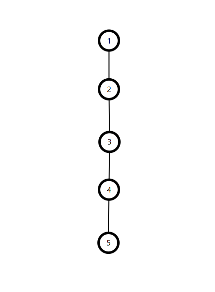
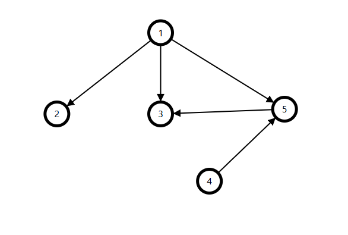
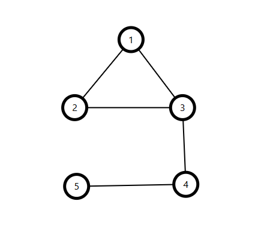

# Introduction to Graph

## Definition

A **Graph** is a data structure consisting of a set of **nodes** (also called **vertices**) and a set of **edges** connecting them. Graphs are fundamental in competitive programming for solving problems related to connectivity, shortest paths, cycles, and components.

---

## Key Concept

* A graph $G = (V, E)$ contains:
  * **$V$**: a set of vertices (nodes)  
  * **$E$**: a set of edges connecting pairs of vertices  
* Edges can be **directed** or **undirected**  
* Edges can be **weighted** or **unweighted**  
* Common subtypes include **trees** and **DAGs**  
* Represented using **adjacency lists** or **adjacency matrices**  


---

## Terminology

| Term             | Meaning                                                        |
|------------------|----------------------------------------------------------------|
| Vertex (Node)    | A point or object in the graph                                 |
| Edge             | A connection between two vertices                              |
| Adjacent         | Two vertices are adjacent if connected by an edge              |
| Degree           | Number of edges connected to a vertex                          |
| Path             | A sequence of vertices connected by edges                      |
| Cycle            | A path that starts and ends at the same vertex                 |
| Connected Graph  | Every vertex is reachable from every other vertex              |
| Disconnected Graph | At least one vertex is not reachable from others             |
| Tree             | A connected, acyclic undirected graph                          |
| DAG              | Directed Acyclic Graph (no cycles)                             |

---

## Types of Graphs

1. **Undirected Graph**  
   Edges have no direction — $(u, v) = (v, u)$  
   <div align="center">
       
   </div>

2. **Directed Graph (Digraph)**  
   Edges have a direction — $(u, v) \neq (v, u)$  
   <div align="center">
       
   </div>

3. **Unweighted Graph**  
   All edges are considered equal (weight = 1)  
   <div align="center">
       
   </div>

4. **Weighted Graph**  
   Each edge has a cost or weight  
   <div align="center">
       
   </div>

5. **Cyclic Graph**  
   Contains at least one cycle  
   <div align="center">
       
   </div>

6. **Acyclic Graph**  
   Contains no cycles  
   <div align="center">
       
   </div>

7. **Tree**  
   A connected, undirected, acyclic graph with $n$ nodes and $n-1$ edges  
   <div align="center">
       
   </div>

8. **DAG (Directed Acyclic Graph)**  
   A directed graph with no cycles  
   <div align="center">
       
   </div>

9. **Connected Graph**  
   Every vertex is reachable from every other vertex  
   <div align="center">
       
   </div>

10. **Disconnected Graph**  
    At least one vertex is not reachable from others  
   <div align="center">
       
   </div>
---

## Adjacency List

- Stores a list of neighbors for each node  
- Efficient for **sparse graphs**  
- **Space complexity**: $O(n + m)$  
- **Edge check complexity**: $O(\text{degree})$  


=== "c++"
```c++
vector<vector<int>> adj(n);
adj[u].push_back(v);
adj[v].push_back(u);  // if undirected
```

=== "Python"
```python
adj = [[] for _ in range(n)]
adj[u].append(v)
adj[v].append(u)  # if undirected
```

## Adjacency Matrix

- 2D matrix of size $n \times n$  
- $adj[u][v] = 1$ means there is an edge from node $u$ to node $v$  
- Suitable for **dense graphs**  
- **Space complexity**: $O(n^2)$  
- **Edge check complexity**: $O(1)$  
- Simple and fast lookups  
- Not space-efficient for sparse graphs  

=== "c++"
```c++
vector<vector<int>> adj(n, vector<int>(n, 0));
adj[u][v] = 1;
adj[v][u] = 1;  // if undirected
```

=== "Python"
```python
adj = [[0] * n for _ in range(n)]
adj[u][v] = 1
adj[v][u] = 1  # if undirected
```

---

## Graph Traversal

Graph traversal refers to the techniques used to visit all the nodes in a graph, much like iterating through an array or a vector. Two fundamental methods are **Depth-First Search (DFS)**, which uses a stack or recursion to explore as far as possible along each branch, and **Breadth-First Search (BFS)**, which uses a queue to explore neighbors level by level. We will cover these traversal algorithms in detail in upcoming blog posts.
