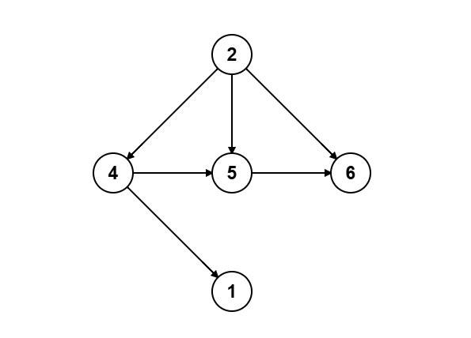
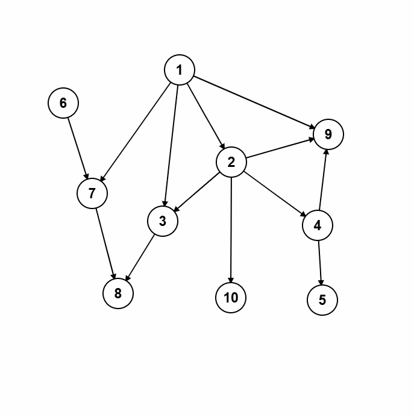

# الترتيب الطوبولوجي (خوارزمية كان)

## المقدمة

الترتيب الطوبولوجي هو خوارزمية لترتيب رؤوس (vertices) مخطط موجه لا دوري (directed acyclic graph، DAG) في تسلسل خطي بحيث لكل حافة موجهة `u → v`، يأتي الرأس `u` قبل `v` في الترتيب. يُستخدم هذا بشكل خاص عند نمذجة المهام ذات المتطلبات السابقة (prerequisites)، مثل تحديد ترتيب سليم لدراسة المقررات (courses) التي تتطلب أخرى كمتطلبات سابقة.

---

## وصف الخوارزمية

تعتمد طريقة درجات الدخول (in-degree) — خوارزمية كان (Kahn’s Algorithm) — على العمل فقط مع مخططات DAG، أي التي تحتوي على حواف (edges) موجهة دون وجود دورات. إذا وجد دورة، فلا يمكن إيجاد ترتيب طوبولوجي يلبي كل المتطلبات.

**الترتيب الطوبولوجي** هو تتابع لكل الرؤوس حيث تشير كل حافة موجهة من رأس سابق إلى رأس لاحق في التسلسل. في مخطط DAG قد توجد **ترتيبات طوبولوجية متعددة** صالحة، إذ يمكن ترتيب الرؤوس المستقلة بأي تسلسل فيما بينها.

إذا لم نجد الخوارزمية أي رأس درجته الداخلة (in-degree) تساوي 0 في خطوة ما، فهذا يعني وجود دورة في الجزء المتبقي من المخطط، وبالتالي لا يوجد ترتيب طوبولوجي.

**الفكرة الأساسية:**  
1. احسب درجة الدخول لكل رأس (عدد الحواف الداخلة إليه).  
2. اجمع كل الرؤوس ذات درجة الدخول 0 في قائمة انتظار (queue) — فهي بلا متطلبات سابقة.  
3. كرر: أزل الرأس u من القائمة، أضفه إلى الترتيب الطوبولوجي، ثم “أزل” حواف الخروج منه بتقليل درجة الدخول لجيرانه.  
4. إذا أصبحت درجة الدخول لأي جار 0، أضفها إلى القائمة.  
5. واصل حتى تصبح القائمة فارغة. إذا أضفت جميع الرؤوس، فقد حصلت على ترتيب طوبولوجي صحيح، وإلا فالدورة تمنع إكمال الترتيب.

تعمل هذه الطريقة دائمًا على مخطط DAG لأن هناك رأسًا واحدًا على الأقل درجته الداخلة 0 (إلا في حال وجود دورة). يؤدي إزالة الرؤوس بهذه الطريقة إلى تقليص المخطط تدريجيًا مع الحفاظ على قيود الترتيب.

> **مثال على DAG صالح:**  
> <div align="center">  
>     
> </div>  
> في هذا المخطط، أحد الترتيبات الطوبولوجية الصحيحة هو: 2, 4, 1, 5, 6.

> **مثال على مخطط دوري:**  
> <div align="center">  
>     
> </div>  
> يحتوي هذا المخطط على دورة، وبالتالي لا يوجد ترتيب طوبولوجي.

---

## التنفيذ

=== "C++"
```cpp
#include <bits/stdc++.h>
using namespace std;

vector<int> topological_sort(int n, const vector<vector<int>>& adj) {
    vector<int> indegree(n, 0), order;
    queue<int> q;
    // حساب درجات الدخول
    for (int u = 0; u < n; ++u)
        for (int v : adj[u])
            indegree[v]++;
    // إضافة الرؤوس ذات in-degree = 0 إلى القائمة
    for (int i = 0; i < n; ++i)
        if (indegree[i] == 0)
            q.push(i);
    // معالجة القائمة
    while (!q.empty()) {
        int u = q.front(); q.pop();
        order.push_back(u);
        for (int v : adj[u]) {
            indegree[v]--;
            if (indegree[v] == 0)
                q.push(v);
        }
    }
    return order; // إذا كان order.size() < n فالمخطط دوري
}
```

=== "Python"
```python
from collections import deque

def topological_sort(n, adj):
    indegree = [0]*n
    for u in range(n):
        for v in adj[u]:
            indegree[v] += 1
    q = deque([u for u in range(n) if indegree[u] == 0])
    order = []
    while q:
        u = q.popleft()
        order.append(u)
        for v in adj[u]:
            indegree[v] -= 1
            if indegree[v] == 0:
                q.append(v)
    return order  # إذا len(order) < n فإن المخطط دوري
```

---

## الشرح التفصيلي للخطوات

افترض:
```
V = {1..10}
E = {
  (1,2),(2,3),(2,4),(4,5),(1,9),
  (3,8),(6,7),(7,8),(1,3),(1,7),
  (2,9),(4,9),(2,10)
}
```
<div align="center">
    
</div>

| الخطوة | القائمة     | درجات الدخول                          | المخرج                           |
|--------|-------------|----------------------------------------|----------------------------------|
| 0      | [1,6]       | [0,0,1,2,1,1,0,2,2,3,1]               | []                               |
| 1      | [6,2]       | [0,0,0,1,1,1,0,1,2,2,1]               | [1]                              |
| 2      | [2,7]       | [0,0,0,1,1,1,0,0,2,2,1]               | [1,6]                            |
| 3      | [7,3,4,10]  | [0,0,0,0,0,1,0,0,2,2,0]               | [1,6,2]                          |
| 4      | [3,4,10]    | [0,0,0,0,0,1,0,0,1,2,0]               | [1,6,2,7]                        |
| 5      | [4,10,8]    | [0,0,0,0,0,1,0,0,0,2,0]               | [1,6,2,7,3]                      |
| 6      | [10,8,5,9]  | [0,0,0,0,0,0,0,0,0,2,0]               | [1,6,2,7,3,4]                    |
| 7      | [8,5,9]     | [0,0,0,0,0,0,0,0,0,1,0]               | [1,6,2,7,3,4,10]                 |
| 8      | [5,9]       | [0,0,0,0,0,0,0,0,0,1,0]               | [1,6,2,7,3,4,10,8]               |
| 9      | [9]         | [0,0,0,0,0,0,0,0,0,0,0]               | [1,6,2,7,3,4,10,8,5]             |
| 10     | []          | [0,0,0,0,0,0,0,0,0,0,0]               | [1,6,2,7,3,4,10,8,5,9]           |

أحد الترتيبات الصالحة هو **1, 6, 2, 7, 3, 4, 10, 8, 5, 9**.

#### ترتيبات أخرى صحيحة
- **6, 1, 2, 7, 3, 4, 10, 8, 5, 9**  
- **1, 2, 6, 7, 3, 4, 10, 8, 5, 9**  
- **1, 6, 2, 3, 7, 4, 10, 8, 5, 9**

---

## التعقيد الزمني

تعالج خوارزمية كان (Kahn) كل رأس مرة واحدة (enqueue/dequeue) وتفحص كل حافة مرة واحدة عند تقليل درجات الدخول. يستغرق حساب الدرجات الأولية $O(E)$، ومعالجة الرؤوس $O(V)$، ومعالجة الحواف $O(E)$. بالمجمل، التعقيد هو $O(V + E)$. تحتاج الذاكرة أيضًا $O(V + E)$ لتمثيل المخطط و $O(V)$ لمصفوفة in-degree والقائمة.

---

## التطبيقات

يُستخدم الفرز الطوبولوجي في:

- **جدولة المواد**: إيجاد ترتيب دراسة المواد بناءً على المتطلبات السابقة.  
- **تخطيط المشاريع**: جدولة المهام ذات التبعيات (PERT).  
- **البرمجة الديناميكية على DAGs**: حل المشكلات حيث تشكل الحالات DAG بالتسلسل الطوبولوجي.  
- **مسارات أقصر في DAG**: حساب المسارات الأقصر في مخطط DAG بـ $O(V + E)$ عن طريق التسلسل الطوبولوجي.  
- **حل تبعيات الموديلات**: ترتيب وحدات أو مراحل تتطلب نتائج مراحل سابقة.  
- **ترتيب البناء**: تحديد ترتيب الترجمة أو الاختبارات في قواعد الكود الكبيرة ذات التبعيات بين الملفات.

---

## طريقة بديلة باستخدام DFS

يمكن أيضًا إيجاد الترتيب الطوبولوجي عبر **DFS + مكدس**: نقوم باستدعاء DFS بشكل تكراري، ثم ندفع (push) الرأس على المكدس بعد زيارة جميع أبنائه. عند تفريغ المكدس (pop) نحصل على ترتيب طوبولوجي صالح. هذه الطريقة أيضًا تعمل في $O(V + E)$.
