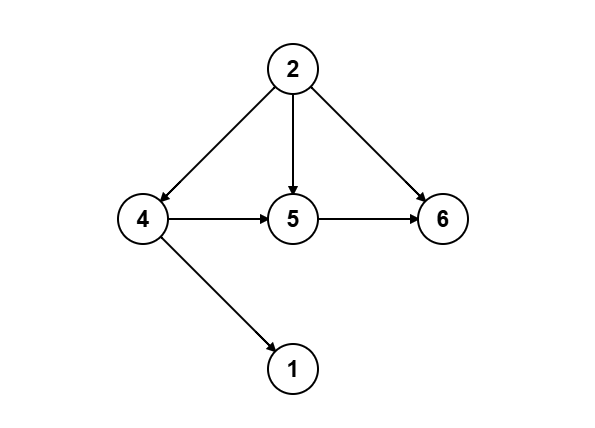
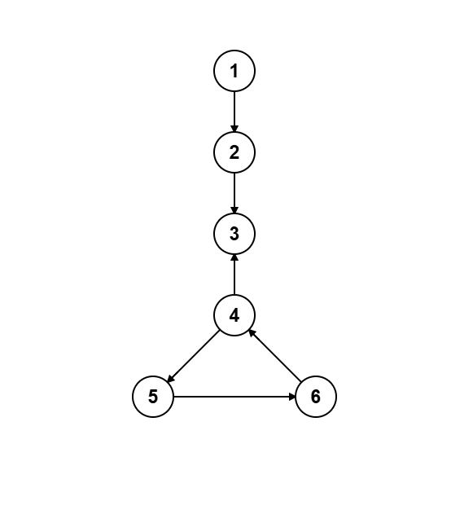
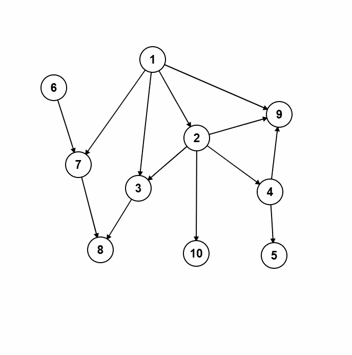

# Topological Sort (Kahn’s Algorithm)

## Introduction

Topological sorting is an algorithm for ordering the vertices of a **directed acyclic graph (DAG)** in a linear sequence such that for every directed edge `u → v`, vertex `u` comes before `v` in the ordering. This is especially useful when modeling tasks with prerequisites, for example determining a valid order to take courses where some courses require others as prerequisites.

---

## Description of the Algorithm

The in-degree method (Kahn’s Algorithm) works only on **DAGs**—graphs with directed edges and no cycles. If a cycle exists, no topological order can satisfy all dependencies.

A **topological order** is a sequence of all vertices such that every directed edge points from an earlier vertex to a later one in the sequence. In a DAG there may be **multiple** valid topological orders, since independent vertices can be arranged in any order relative to each other.

If the algorithm cannot find a vertex with in-degree 0 at some step, that means the remaining graph has a cycle, and therefore no topological ordering exists.

**Core idea:**  
1. Compute each vertex’s **in-degree** (number of incoming edges).  
2. Collect all vertices with in-degree 0 into a queue—these have no prerequisites.  
3. Repeatedly remove a vertex `u` from the queue, append it to the topological order, and “remove” its outgoing edges by decrementing the in-degrees of its neighbors.  
4. If any neighbor’s in-degree becomes 0, enqueue it.  
5. Continue until the queue is empty. If you have output all vertices, you have a valid topological order. Otherwise, a cycle prevents completion.

This method always works on a DAG because at least one vertex in a DAG has in-degree 0 (otherwise a cycle would form). Removing vertices in this way gradually reduces the graph while preserving the order constraints.

**Example of a valid DAG:**  
<div align="center">  
    
</div>  
In this graph, one correct topological order is **2, 4, 1, 5, 6**.

**Example of a cyclic graph:**  
<div align="center">  
    
</div>  
This graph contains a cycle and thus has **no** topological ordering.

---

## Implementation

=== "C++"
```cpp
#include <bits/stdc++.h>
using namespace std;

vector<int> topologicalSort(int n, const vector<vector<int>>& adj) {
    vector<int> indegree(n, 0), order;
    queue<int> q;
    // Compute in-degrees
    for (int u = 0; u < n; ++u)
        for (int v : adj[u])
            indegree[v]++;
    // Enqueue vertices with in-degree 0
    for (int i = 0; i < n; ++i)
        if (indegree[i] == 0)
            q.push(i);
    // Process queue
    while (!q.empty()) {
        int u = q.front(); q.pop();
        order.push_back(u);
        for (int v : adj[u]) {
            indegree[v]--;
            if (indegree[v] == 0)
                q.push(v);
        }
    }
    return order;
}
```

=== "Python"
```python
from collections import deque

def topological_sort(n, adj):
    indegree = [0]*n
    for u in range(n):
        for v in adj[u]:
            indegree[v] += 1
    q = deque([u for u in range(n) if indegree[u] == 0])
    order = []
    while q:
        u = q.popleft()
        order.append(u)
        for v in adj[u]:
            indegree[v] -= 1
            if indegree[v] == 0:
                q.append(v)
    return order  # if len(order) < n, a cycle exists
```

---

## Detailed Walkthrough

Consider:

```
V = {1..10}
E = {
  (1,2),(2,3),(2,4),(4,5),(1,9),
  (3,8),(6,7),(7,8),(1,3),(1,7),
  (2,9),(4,9),(2,10)
}
```

<div align="center">
    
</div>

| Step | Queue       | In-Degrees                     | Output                          |
|------|-------------|--------------------------------|---------------------------------|
| 0    | [1,6]       | [0,0,1,2,1,1,0,2,2,3,1]        | []                              |
| 1    | [6,2]       | [0,0,0,1,1,1,0,1,2,2,1]        | [1]                             |
| 2    | [2,7]       | [0,0,0,1,1,1,0,0,2,2,1]        | [1,6]                           |
| 3    | [7,3,4,10]  | [0,0,0,0,0,1,0,0,2,2,0]        | [1,6,2]                         |
| 4    | [3,4,10]    | [0,0,0,0,0,1,0,0,1,2,0]        | [1,6,2,7]                       |
| 5    | [4,10,8]    | [0,0,0,0,0,1,0,0,0,2,0]        | [1,6,2,7,3]                     |
| 6    | [10,8,5,9]  | [0,0,0,0,0,0,0,0,0,2,0]        | [1,6,2,7,3,4]                   |
| 7    | [8,5,9]     | [0,0,0,0,0,0,0,0,0,1,0]        | [1,6,2,7,3,4,10]                |
| 8    | [5,9]       | [0,0,0,0,0,0,0,0,0,1,0]        | [1,6,2,7,3,4,10,8]              |
| 9    | [9]         | [0,0,0,0,0,0,0,0,0,0,0]        | [1,6,2,7,3,4,10,8,5]            |
| 10   | []          | [0,0,0,0,0,0,0,0,0,0,0]        | [1,6,2,7,3,4,10,8,5,9]          |

One valid topological order is **1, 6, 2, 7, 3, 4, 10, 8, 5, 9**.

#### Other valid orders
- **6, 1, 2, 7, 3, 4, 10, 8, 5, 9**  
- **1, 2, 6, 7, 3, 4, 10, 8, 5, 9**  
- **1, 6, 2, 3, 7, 4, 10, 8, 5, 9**

---

## Time Complexity

Kahn’s algorithm processes each vertex exactly once (enqueue/dequeue) and examines each edge exactly once when decrementing in-degrees. Computing initial in-degrees takes $O(E)$, processing vertices costs $O(V)$, and handling edges costs $O(E)$. Altogether, this yields $O(V + E)$ time. Space usage is $O(V + E)$ for the graph representation plus $O(V)$ for the in-degree array and queue.

---

## Applications

Topological sort is used in:

- **Course Scheduling:** Find a valid order of courses given prerequisites.  
- **Project Planning:** Schedule tasks with dependencies (PERT).  
- **DP on DAGs:** Solve DP where states form an acyclic dependency graph by processing in topological order.  
- **DAG Shortest Paths:** Compute shortest paths in a DAG in $O(V + E)$ by relaxing vertices in topological order.  
- **Dependency Resolution:** Order problem subsets or modules where some depend on results of others (e.g. multi-phase graph problems).  
- **Build Order:** Decide order of compilation or test cases in large codebases with inter-file dependencies.  

---

## DFS-Based Alternative

You can also perform topological sort via **DFS + stack**: recursively DFS and push each node onto a stack after exploring its descendants. Popping the stack yields a valid topological order. This also runs in $O(V + E)$ and is covered in many resources.

