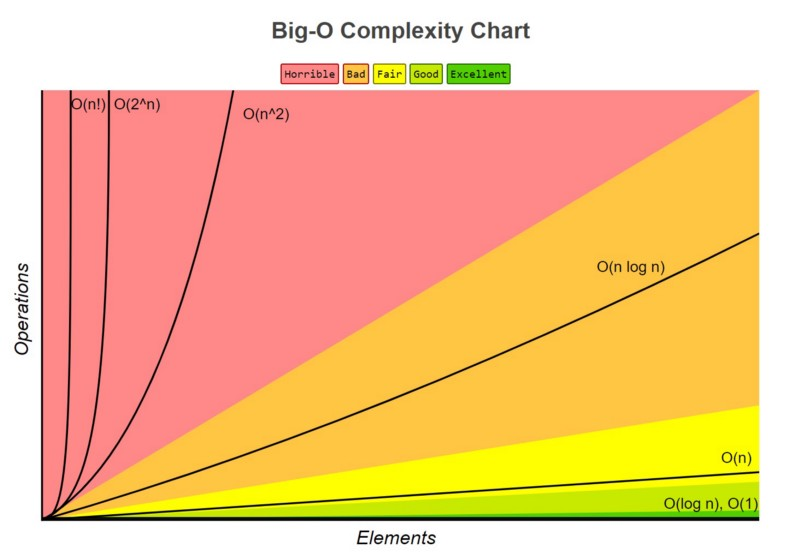

# التعقيد (الرمز O الكبير)

## التعريف

يُستخدم الرمز O الكبير في علوم الحاسوب (وخاصة في البرمجة التنافسية) لقياس نمو الزمن والمساحة مع زيادة حجم البيانات، ولتقريب الزمن والمساحة المستخدمين في أسوأ الحالات، وهو أسلوب ممتاز لمقارنة خوارزميتين أو كودين مختلفين لحل مهمة ما.

بشكل عام، يمكن حساب الرمز O الكبير بعدّ عدد العمليات المنفذة في الكود وتجاهل الثوابت الصغيرة.

## أمثلة

فيما يلي بعض الأكواد العامة ورموز التعقيد الخاصة بها:

```pascal
Counter := 0
Counter := Counter + 10
```

تعقيد هذا الكود هو $O(1)$، إذ نرى وجود عمليتين فقط، وسيقوم الكود دائمًا بتنفيذهما، ولأن الرمز O الكبير يتجاهل الثوابت الصغيرة فإن $O(1)=O(2)$.

```pascal
Input N
Counter := 0
If N%2 == 0 Then
    Counter := Counter + 1
Else if N % 2 == 0 Then
    Counter := Counter + 2
End If
```

تعقيد هذا الكود أيضًا هو $O(1)$، إذ نرى وجود العديد من العمليات (جمع، باقٍ، قراءة الإدخال، وعبارات If) وهي كلها ثوابت لذا التعقيد $O(1)$.

```pascal
Input N
Counter := 0
While Counter <= N do
    Counter := Counter + 1
End While
```

تعقيد هذا الكود هو $O(N)$، حيث أن الحلقة while ستعمل حتى يصبح العداد أكبر من $N$، و$N$ قيمة مدخلة، لذا عدد مرات التكرار يتغير بحسب قيمة $N$، والعدد الدقيق للتكرارات هو $N+1$ (لأننا نبدأ من 0)، فلماذا لا نقول $O(N+1)$ إذًا؟ لأن الزمن يعتمد بشكل أكبر على $N$ ويمكننا تجاهل الثابت 1.

## قواعد الحساب

### 1. جمع الأزمان

```pascal
Counter := 0
Counter := Counter + 1

For i from 1 to N:
    Counter := Counter + 1

For i from 1 to M:
    Counter := Counter + 1
```

هنا نجد زمن كل جزء ثم نجمعها (العملية الأولى، الحلقة الأولى، الحلقة الثانية). الجزء الأول زمنه ثابت $O(1)$، والجزء الثاني يقوم بـ N عملية جمع فيكون $O(N)$، والجزء الثالث $O(M)$. لحساب الزمن الكلي $T(\text{total})$ نجمع:

$$
T(\text{Total}) = T(\text{FirstPart}) + T(\text{SecondPart}) + T(\text{ThirdPart})
= 1 + N + M
$$

ونحصل على التعقيد $O(N + M + 1)$، وبما أن الرمز O يتجاهل الثوابت نتجاهل 1 لنحصل على $O(N + M)$. ملاحظة: لا يمكن تجاهل $N$ أو $M$ لأنهما قد تكونان كبيرتين.

### 2. ضرب الأزمان

```pascal
Counter_1 := 0
Counter_2 := 0

For i from 1 to N:
    For j from 1 to M:
        Counter_1 := Counter_1 + 1
        Counter_2 := Counter_2 + 1
```

لتبسيط، نتجاهل الحلقة الأولى مؤقتًا فنجد أن داخل الحلقة الثانية عمليتَي جمع مكررتين M مرة فيكون الزمن $O(2M)$. ثم نعيد الحلقة الأولى فتتكرر هذه $O(2M)$ N مرة، فنحصل على:

$$
T(\text{Total}) = N \times (2M) = 2NM
$$

وبما أن الرمز O يتجاهل الثوابت الصغيرة نحذف 2 لنحصل على $O(NM)$.

مثال آخر لعمليات متداخلة:

```pascal
Counter_1 := 0
Counter_2 := 0
For i from 1 to N:
    For j from 1 to M:
        For k from 1 to L:
            Counter_1 := Counter_1 + 1
            Counter_2 := Counter_2 + 1
            Counter_1 := Counter_1 + 1
            Counter_2 := Counter_2 + 1
```

لدينا ثلاث حلقات متداخلة تتكرر N، M، و L مرات على التوالي، و4 عمليات داخل الحلقة الأخيرة. هذه العمليات تتكرر L مرة، ثم تتكرر M مرة، ثم N مرة، فيكون التعقيد $O(4 \cdot N \cdot M \cdot L)$، ونتجاهل 4 لنحصل على $O(N \cdot M \cdot L)$.

### 3. غير الثابت

أحيانًا لا تتحرك الحلقات بخطوة 1، مثل:

```pascal
For i from 1 to N:
    i := i + 1
```

هذه الحلقة تتحرك بخطوتين فيكون الزمن $O(\tfrac{N}{2})$، ويمكننا تجاهل $\tfrac12$. لكن في حالات أخرى لا يمكن تجاهل التغيير في الخطوات، مثال:

```pascal
Input N
While N > 0:
    N := N / 2
```

هنا نقسم $N$ على 2 في كل تكرار، فكل تكرار يقوم بعملية واحدة ويجعل $N$ يساوي $N/2$. كم مرة نكرر حتى يصل $N$ إلى 0؟ يمكننا القسمة على 2 $\log_2(N)$ مرات، فيكون الزمن $O(\log_2(N))$.

## مقارنة أشهر تعقيدات الزمن

<div align="center">
    
</div>

فيما يلي بعض التعقيدات الشائعة التي قد تراها:

$$
O(1) < O(\log n) < O(n) < O(n \log n) < O(n^2) < O(2^n) < O(n!)
$$

**ملاحظة:**

* في البرمجة التنافسية عادة ما يشير $\log$ إلى $\log_2$.
* الرمز `!` يدل على عامل الضرب التراكمي (الفاكتوريال).
