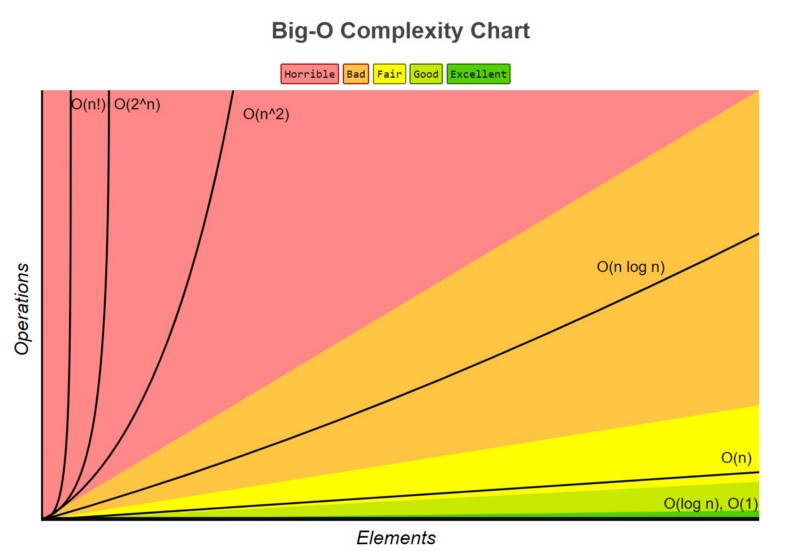

# Complexity (big O notation)

## Definition

The big O notation in computer science (and competitive programming in particular) is used to find the growth of space and time when the data grows, and to approximate the time and space used in the worst case, which is a great way to compare two different algorithms or codes used to solve some task.

In general, we can calculate the big O notation by counting the number of operations done in some code and ignoring small constant values.

## Examples

Here are some general codes and their big O notation:

```
Counter := 0
Counter := Counter + 10
```

The complexity for this code is $O(1)$, as we see there are only 2 operations so the code will always do them 2, and since big O notation ignores small constants then $O(1)=O(2)$.


```
Input N
Counter := 0
If N%2 == 0 Then
    Counter := Counter + 1
Else if N % 2 == 0 Then
    Counter := Counter + 2
End If
```

The complexity for this code is also $O(1)$, as we see there are many operations (addition, module, read input, and If statements) which are all constants so the complexity is $O(1)$.

```
Input N
Counter := 0
While Counter <= N do
    Counter := Counter + 1
End While
```

The complexity for this code is also $O(N)$, here the while loop will run until the counter becomes more than N, and N is input so the while loop iterations will change based on the value of N, so the exact number of iterations is N+1 (since we start from 0), why don't we say that the complexity is $O(N+1)$ then? Because the time spent is more dependent on the value of N we can ignore the constant 1.

## Rules of calculation

### 1. Adding Time

```
Counter := 0
Counter := Counter + 1

For i from 1 to N:
    Counter := Counter + 1

For i from 1 to M:
    Counter := Counter + 1
```

Here we simply find the time spent in each part then add them together (addition, first loop, second loop), for the first part the addition takes a constant time $O(1)$, the second part it does N addition N times so the time complexity is $O(N)$, and the last part does M operations $O(M)$, to calculate the total time $T(total)$ we just add all the times taken for each part:

$$T(Total) = T(FirstPart) + T(SecondPart) + T(ThirdPart)$$
$$= 1 + N + M$$

And we get the total complexity of $O(N + M + 1)$ and since big O notation ignores small parts we can ignore the constant 1 and get $O(N + M)$, Note: we can't ignore N nor M since we don't know their exact value and who will contribute more to the time.

### 2 - Multiplying Time

```
Counter_1 := 0
Counter_2 := 0

For i from 1 to N:
    For j from 1 to M:
        Counter_1 := Counter_1 + 1
        Counter_2 := Counter_2 + 1
```

Let's ignore the first loop (from 1 to N) we will have 2 addition operations repeated M times with a complexity of $O(2M)$, now let's bring back the first loop what does it change? As we see how the second loop and everything inside it are repeated N times we just multiply the second loop time: 
$$T(Total) = T(FirstLoop) \cdot (T(SecondLoop) \cdot NumverOfOperations)$$
$$T(Total) = N\cdot(M\cdot2)$$
$$=2NM$$

And we get the total complexity of $O(2NM)$ and since big O notation ignores small parts we can remove the constant 2 since it is not important when N or M is very big, and get $O(NM)$.

Let's give another example of nested operations:

```
Counter_1 := 0
Counter_2 := 0
For i from 1 to N:
    For j from 1 to M:
        For k from 1 to L:
            Counter_1 := Counter_1 + 1
            Counter_2 := Counter_2 + 1
            Counter_1 := Counter_1 + 1
            Counter_2 := Counter_2 + 1
```

We have three nested loops that repeat N, M, and L times respectively, and 4 operations inside the last loop we can see that the 4 operations are repeated L times, the third loop is repeated M times, and the second loop is repeated N times so the time complexity is $O(4 \cdot N \cdot M \cdot L)$, we can ignore the 4 and get $O(N \cdot M \cdot L)$.

### 3 - Non-Constant
Sometimes the loops don't move by 1 like the previous examples, maybe they move by 2 like:

```
For i from 1 to N:
    i := i + 1
```

This loop moves by 2 so the time spent is $O({N\over 2})$ here we can ignore the $1\over 2$, but in some other cases we can't just ignore the change in the moves, here is an example:

```
Input N
While N > 0:
    N := N / 2
```

Here we divide N by 2 for every move so the time spent can be calculated as follow : 

$$T(0) = 0$$
$$T(N) = 1 + T({N \over 2}), N > 0$$

Here the time Taken for input N is 0 if N is 0 because we will exit the loop, and each iteration does 1 divide operation and move N to N / 2, but how many times will the loop move until N reaches 0 if we look closely we will see that we can divide N by 2 $Log_2(N)$ times only so the total time is $T(N) = 1 \cdot Log_2(N)$ because the addition operations is repeated $Log_2(N)$ times time complicity is $O(Log_2(N))$.

## Popular time complexity Comparison
<div align="center">
    
</div>

Here is some of the popular complexities you will see:
$$O(1) < O(log n) < O(n) < O(n log n) < O(n^2) < O(2^n) < O(n!)$$

Note:
* In comparative programming log usually refer to $Log_2$ (to the base 2).
* the symbol `!` refers to the factorial operation.
