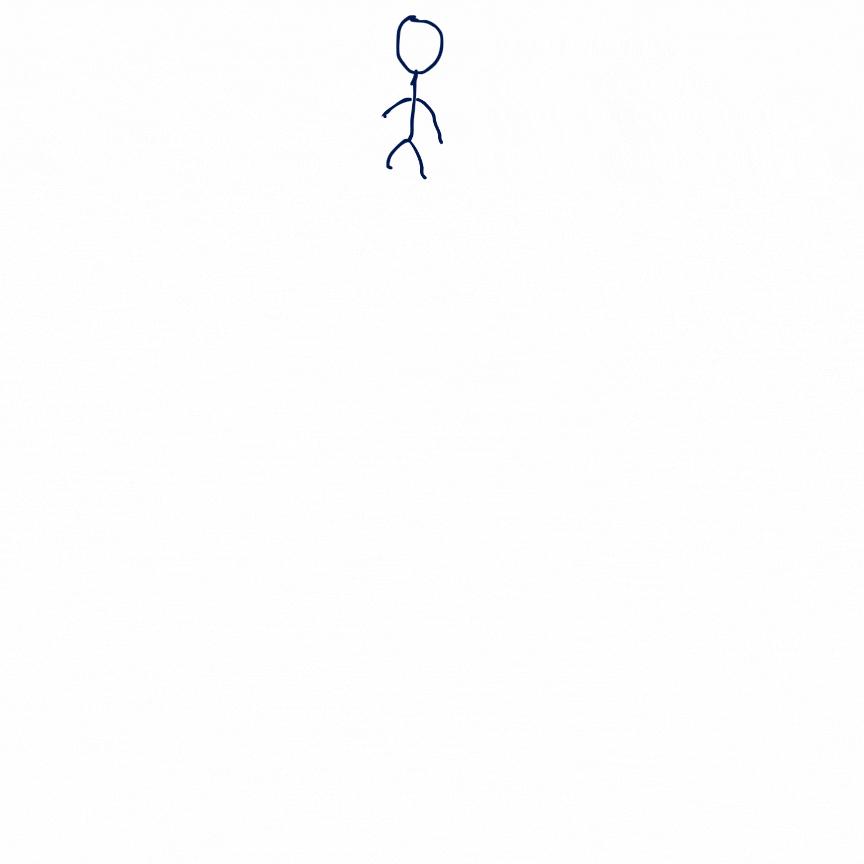
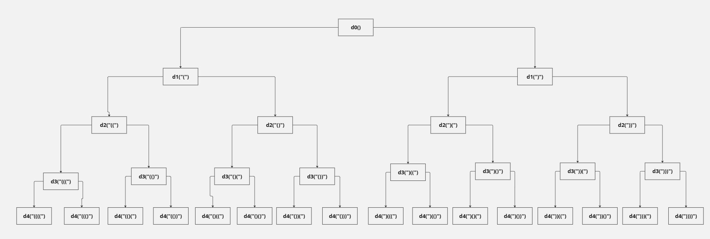

# Complete Search

Complete search is a brute-force technique where you literally try all possible combinations.

Let's take an example of the following problem:

You are given an even positive integer $n$. You should print all regular bracket sequences of length $n$.

A regular bracket sequence (RBS) is a sequence of brackets that is correctly balanced and properly nested. Formally, a sequence consisting of `(` and `)` is a regular bracket sequence if:

- Every opening bracket `(` has a corresponding closing bracket `)`.
- At any point in the sequence, the number of closing brackets `)` never exceeds the number of opening brackets `(` when reading from left to right.

### Examples of Regular Bracket Sequences:

```
()
(())()
((()))
()()
```

### Examples of Irregular (Invalid) Bracket Sequences:

```
)(
(()
())(
```

A brute-force solution for this problem would be to generate all possible sequences of length $n$, then check for each sequence whether it is regular or not.

We can use this code to check if a string is an RBS or not:

```c++
bool is_rbs(string &s) {
    int cnt = 0;
    for (int i = 0; i < (int)s.size(); i++) {
        if (s[i] == ')') {
            cnt--;
            if (cnt < 0)
                return false;
        } else {
            cnt++;
        }
    }
    return cnt == 0;
}
```

Now, the problem is to generate all possible sequences of length $n$, where each character is either `(` or `)`.

One known way to do this on paper is to draw a tree as follows:

- You start at the root of the tree with an empty sequence.
- The first character has two options, either `(` or `)`, so you draw two children, one with `(` and one with `)`.
- For each child, repeat this process by adding `(` and `)` again, forming all combinations of length $2$.
- If the depth of the tree is $d$, adding two edges to the leaf nodes increases the depth to $d + 1$.
- Each leaf represents a sequence of length $d + 1$, where the string is determined by the edges on the path from the root to the leaf.
- To generate all possible RBS of length $n$, repeat this step until the depth is $n$.

Here is an example where $n = 4$:



### Recursive Generation

To write a function that generates all these sequences, we can follow the tree concept. We start at depth $0$, where each choice leads to depth $1$, and each depth level doubles the possibilities until we reach depth $n$.

One way to implement this is by writing a function for each depth level. We start by calling the function at depth `0`, and each function calls the next depth level with the two possible choices.

For example, when $n = 4$, the following code generates all sequences:

```c++
void depth4(string s) {
    if (is_rbs(s))
        cout << s << endl;
}

void depth3(string s) {
    depth4(s + '(');
    depth4(s + ')');
}

void depth2(string s) {
    depth3(s + '(');
    depth3(s + ')');
}

void depth1(string s) {
    depth2(s + '(');
    depth2(s + ')');
}

void depth0() {
    string s;
    depth1(s + '(');
    depth1(s + ')');
}

int main() {
    depth0();
    return 0;
} 
```

The Tree of calls of these functions looks like:



### Optimized Recursive Approach

The previous approach requires writing $n$ separate functions. However, since each function at depth $i$ tries two options and calls the function at depth $i + 1$, we can replace this with a single recursive function where the base case is when the depth reaches $n$.

The optimized recursive solution looks like this:

```c++
void solve(int depth, string s, int n) {
    if (depth == n) {
        if (is_rbs(s)) {
            cout << s << endl;
        }
        return;
    }
    solve(depth + 1, s + "(", n);
    solve(depth + 1, s + ")", n);
}

int main() {
    int n;
    cin >> n;
    solve(0, "", n);
    return 0;
}
```

This recursive function correctly generates all bracket sequences of length $n$, ensuring that only valid sequences are printed.

### Different Implementation

Since passing the string $s$ as a parameter makes the complexity of the call $O(\text{len}(s))$, we can send $s$ by reference to improve efficiency. The code then becomes:

```c++
void solve(int depth, string &s, int n) {
    if (depth == n) {
        if (is_rbs(s)) {
            cout << s << endl;
        }
        return;
    }
    s += "(";
    solve(depth + 1, s, n);
    s += ")";
    solve(depth + 1, s, n);
}

int main() {
    int n;
    cin >> n;
    string s = "";
    solve(0, s, n);
    return 0;
}
```

But is this code correct?

The answer is no. Whenever the function ends and returns to the caller function, we need to ensure that $s$ looks the same as it did before the function was called. To achieve this, we must roll back the changes, so the corrected code will look like this:

```c++
void solve(int depth, string &s, int n) {
    if (depth == n) {
        if (is_rbs(s)) {
            cout << s << endl;
        }
        return;
    }
    s += "(";
    solve(depth + 1, s, n);
    s.pop_back();
    s += ")";
    solve(depth + 1, s, n);
    s.pop_back();
    // After calling solve(depth + 1, s, n), we ensure that string s
    // is the same as it was before the call. Using pop_back() removes
    // the change we made, so we return with no modifications to s.
}

int main() {
    int n;
    cin >> n;
    string s = "";
    solve(0, s, n);
    return 0;
}
```