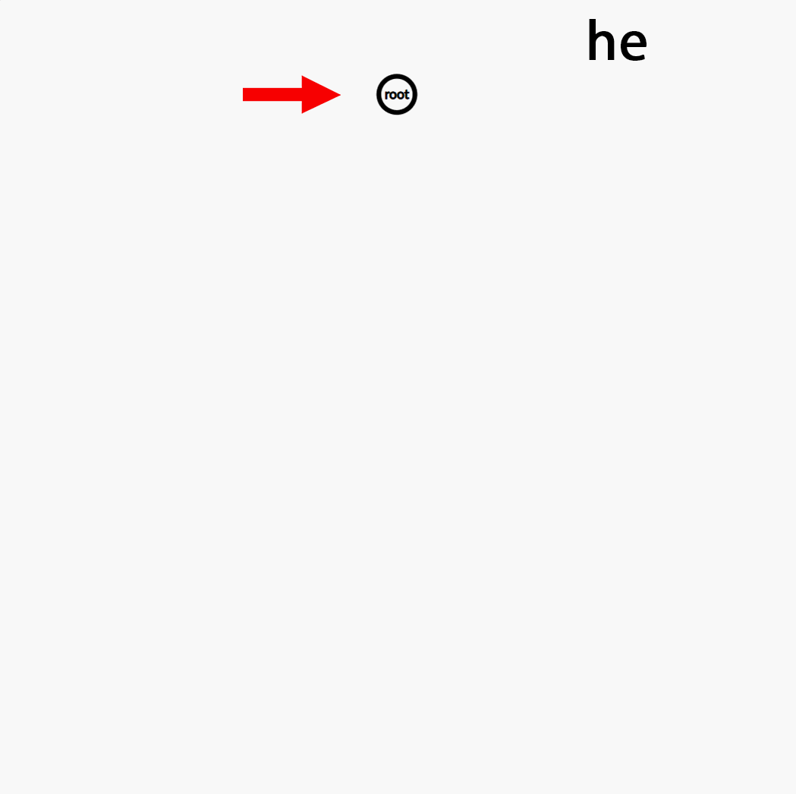

# تراي (شجرة البادئة)

## مقدمة

تُعدّ **تراي** (تنطق "تراي")، والمعروفة أيضًا باسم **شجرة البادئة**، بنية بيانات شجرية تقوم بتخزين مجموعة ديناميكية من السلاسل النصية، حيث تكون المفاتيح عادةً سلاسل نصية. يُمثّل كل عقدة بادئة مشتركة لبعض المفاتيح. من خلال استغلال بنية المفاتيح، تسهّل تراي عمليات البحث والإدراج والحذف بكفاءة في زمن \(O(L)\)، حيث \(L\) هو طول الكلمة.

## هيكل العقدة

تحتوي كل عقدة في التراي عادةً على:  
- **children**: مؤشرات أو مراجع لكل حرف ممكن (مثل مصفوفة بحجم 26 لحروف الإنجليزية الصغيرة، أو خريطة تجزئة للأبجديات الديناميكية).  
- **prefixCount**: عدد الكلمات في التراي التي تشترك في البادئة المنتهية عند هذه العقدة.  
- **endCount**: عدد الكلمات التي تنتهي تمامًا عند هذه العقدة.  
- **parent** (اختياري): مؤشر/مرجع إلى العقدة الأم، مفيد لبعض عمليات التراجع.

رياضيًا، يتطلّب إدراج كلمة أو البحث عنها بطول \(L\) زيارة \(L+1\) عقد (بما في ذلك الجذر)، كل منها في وقت ثابت، أي \(O(L)\) لكل عملية.

=== c++

```cpp
#include <bits/stdc++.h>
using namespace std;

struct TrieNode {
    vector<TrieNode*> children;
    int prefixCount;
    int endCount;
    TrieNode* parent;
    char ch; // الحرف على الحافة من العقدة الأم

    TrieNode(TrieNode* p = nullptr, char c = '#') 
      : children(26, nullptr), prefixCount(0), endCount(0), parent(p), ch(c) {}
};

class Trie {
public:
    TrieNode* root;
    Trie() { root = new TrieNode(); }

    // إدراج كلمة في التراي
    void insert(const string& s) {
        TrieNode* node = root;
        node->prefixCount++;
        for (char c : s) {
            int idx = c - 'a';
            if (!node->children[idx])
                node->children[idx] = new TrieNode(node, c);
            node = node->children[idx];
            node->prefixCount++;
        }
        node->endCount++;
    }

    // البحث عن كلمة موجودة تمامًا في التراي
    bool search(const string& s) const {
        TrieNode* node = root;
        for (char c : s) {
            int idx = c - 'a';
            if (!node->children[idx]) return false;
            node = node->children[idx];
        }
        return node->endCount > 0;
    }

    // عدّ الكلمات التي تساوي الكلمة المعطاة
    int countWordsEqualTo(const string& s) const {
        TrieNode* node = root;
        for (char c : s) {
            int idx = c - 'a';
            if (!node->children[idx]) return 0;
            node = node->children[idx];
        }
        return node->endCount;
    }

    // عدّ الكلمات التي تبدأ بالبادئة المعطاة
    int countWordsStartingWith(const string& prefix) const {
        TrieNode* node = root;
        for (char c : prefix) {
            int idx = c - 'a';
            if (!node->children[idx]) return 0;
            node = node->children[idx];
        }
        return node->prefixCount;
    }
};
```

=== Java

```java
import java.util.HashMap;
import java.util.Map;

class TrieNode {
    Map<Character, TrieNode> children = new HashMap<>();
    int prefixCount = 0;
    int endCount = 0;
    TrieNode parent;
    char ch;

    TrieNode(TrieNode p, char c) {
        parent = p;
        ch = c;
    }
}

public class Trie {
    private final TrieNode root;

    public Trie() {
        root = new TrieNode(null, '#');
    }

    // إدراج كلمة في التراي
    public void insert(String s) {
        TrieNode node = root;
        node.prefixCount++;
        for (char c : s.toCharArray()) {
            node.children.putIfAbsent(c, new TrieNode(node, c));
            node = node.children.get(c);
            node.prefixCount++;
        }
        node.endCount++;
    }

    // البحث عن كلمة موجودة تمامًا في التراي
    public boolean search(String s) {
        TrieNode node = root;
        for (char c : s.toCharArray()) {
            if (!node.children.containsKey(c)) return false;
            node = node.children.get(c);
        }
        return node.endCount > 0;
    }

    // عدّ الكلمات التي تساوي الكلمة المعطاة
    public int countWordsEqualTo(String s) {
        TrieNode node = root;
        for (char c : s.toCharArray()) {
            if (!node.children.containsKey(c)) return 0;
            node = node.children.get(c);
        }
        return node.endCount;
    }

    // عدّ الكلمات التي تبدأ بالبادئة المعطاة
    public int countWordsStartingWith(String prefix) {
        TrieNode node = root;
        for (char c : prefix.toCharArray()) {
            if (!node.children.containsKey(c)) return 0;
            node = node.children.get(c);
        }
        return node.prefixCount;
    }
}
```

=== Python

```python
class TrieNode:
    __slots__ = ('children', 'prefix_count', 'end_count', 'parent', 'ch')
    def __init__(self, parent=None, ch='#'):
        self.children = {}
        self.prefix_count = 0
        self.end_count = 0
        self.parent = parent
        self.ch = ch

class Trie:
    def __init__(self):
        self.root = TrieNode()

    # إدراج كلمة في التراي
    def insert(self, s: str) -> None:
        node = self.root
        node.prefix_count += 1
        for c in s:
            if c not in node.children:
                node.children[c] = TrieNode(node, c)
            node = node.children[c]
            node.prefix_count += 1
        node.end_count += 1

    # البحث عن كلمة موجودة تمامًا في التراي
    def search(self, s: str) -> bool:
        node = self.root
        for c in s:
            if c not in node.children:
                return False
            node = node.children[c]
        return node.end_count > 0

    # عدّ الكلمات التي تساوي الكلمة المعطاة
    def count_words_equal_to(self, s: str) -> int:
        node = self.root
        for c in s:
            if c not in node.children:
                return 0
            node = node.children[c]
        return node.end_count

    # عدّ الكلمات التي تبدأ بالبادئة المعطاة
    def count_words_starting_with(self, prefix: str) -> int:
        node = self.root
        for c in prefix:
            if c not in node.children:
                return 0
            node = node.children[c]
        return node.prefix_count
```

- **مثال البحث**: بعد إدراج `"hello"`، فإن `trie.search("hello") == true` و `trie.search("hell") == false`.  
- **مثال العدّ**: تُعيد `trie.countWordsEqualTo("he")` عدد مرّات إدراج `"he"`. وتُعدّ `trie.countWordsStartingWith("he")` جميع الكلمات التي تبدأ بالبادئة `"he"` (مثل `"he"` و `"hello"`).

## تصور الإدراج

فيما يلي ملف GIF يوضح خطوة بخطوة إدراج الكلمات **"he"**، **"cat"**، **"hello"**، و **"car"** في التراي:

<div align="center">
    
</div>
