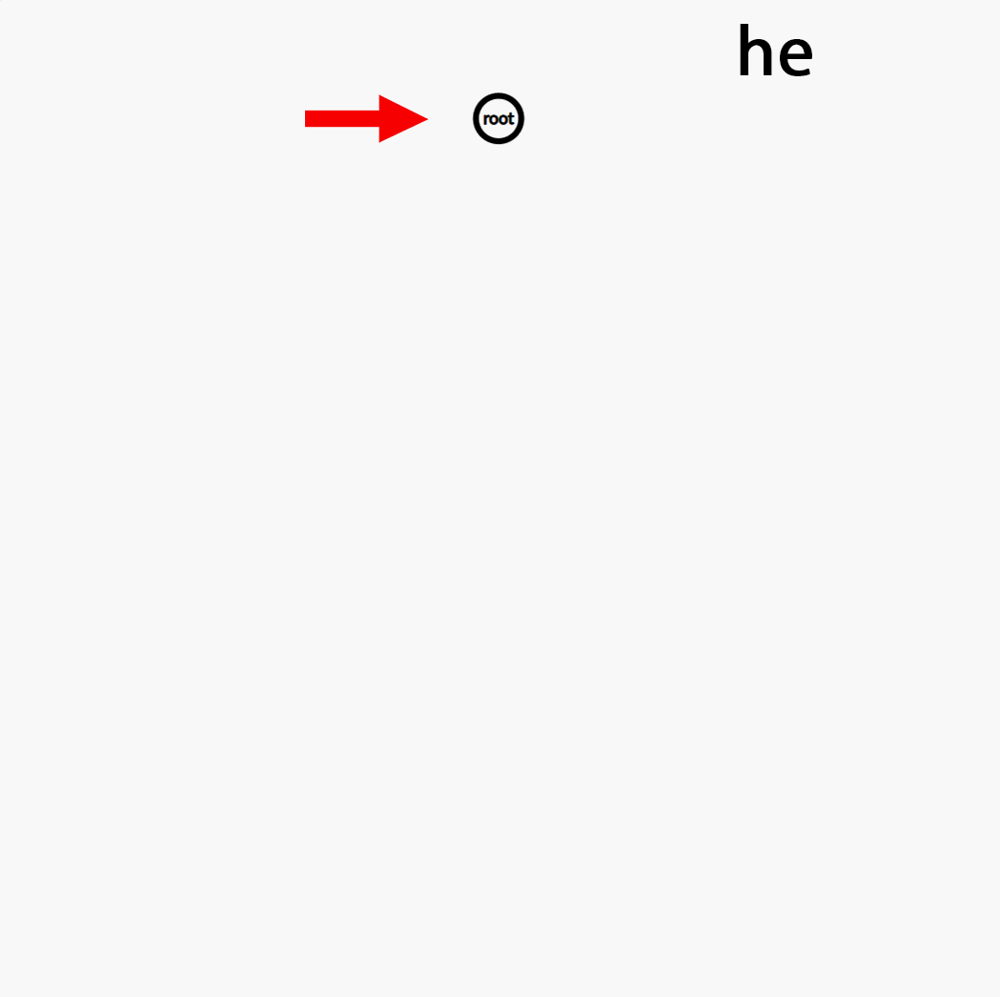

# Trie (Prefix Tree)

## Introduction

A **trie** (pronounced "try"), also known as a **prefix tree**, is a tree-like data structure that stores a dynamic set of strings, where keys are usually strings. Each node represents a common prefix of some keys. By leveraging the structure of the keys, tries can facilitate efficient search, insertion, and deletion operations in $O(L)$ time, where $L$ is the length of the key.

## How a Trie Works

A trie starts with a single **root node** which represents an empty prefix. Each edge from a node corresponds to a character, and each child node represents a longer prefix of the string.

### Insertion

To insert a word into the trie:

1. Start from the root node.
2. For each character `c` in the word:
   - Check if there is already a child node for `c`. If not, create it.
   - Move to the child node for `c`.
   - Increment the `prefixCount` of the node.
3. After all characters are processed, increment the `endCount` at the final node.

### Search

To search for a word, traverse the trie from the root following the path of each character in the word. If any character is missing, the word does not exist. If you reach the last character and the `endCount` is greater than zero, the word exists.

### Prefix Search

To count how many words start with a given prefix, traverse the prefix as you would during a normal search. If the prefix exists, return the `prefixCount` of the last node.


## Node Structure

Each trie node typically contains:
- **children**: pointers or references for each possible character (e.g., array of size 26 for lowercase English letters, or a hashmap for dynamic alphabets).
- **prefixCount**: the number of words in the trie that share the prefix ending at this node.
- **endCount**: the number of words that end exactly at this node.
- **parent** (optional): a pointer/reference to the parent node, useful for certain backtracking operations.

Mathematically, inserting or searching a word of length $L$ into a trie requires visiting $L+1$ nodes (including root), each in constant time, giving $O(L)$ per operation.

=== "c++"

```cpp
#include <bits/stdc++.h>
using namespace std;

struct TrieNode {
    vector<TrieNode*> children;
    int prefixCount;
    int endCount;
    TrieNode* parent;
    char ch; // character on the edge from parent

    TrieNode(TrieNode* p = nullptr, char c = '#') 
      : children(26, nullptr), prefixCount(0), endCount(0), parent(p), ch(c) {}
};

class Trie {
public:
    TrieNode* root;
    Trie() { root = new TrieNode(); }

    // Insert a word into the trie
    void insert(const string& s) {
        TrieNode* node = root;
        node->prefixCount++;
        for (char c : s) {
            int idx = c - 'a';
            if (!node->children[idx])
                node->children[idx] = new TrieNode(node, c);
            node = node->children[idx];
            node->prefixCount++;
        }
        node->endCount++;
    }

    // Search if a word exactly exists in the trie
    bool search(const string& s) const {
        TrieNode* node = root;
        for (char c : s) {
            int idx = c - 'a';
            if (!node->children[idx]) return false;
            node = node->children[idx];
        }
        return node->endCount > 0;
    }

    // Count words equal to the given word
    int countWordsEqualTo(const string& s) const {
        TrieNode* node = root;
        for (char c : s) {
            int idx = c - 'a';
            if (!node->children[idx]) return 0;
            node = node->children[idx];
        }
        return node->endCount;
    }

    // Count words starting with the given prefix
    int countWordsStartingWith(const string& prefix) const {
        TrieNode* node = root;
        for (char c : prefix) {
            int idx = c - 'a';
            if (!node->children[idx]) return 0;
            node = node->children[idx];
        }
        return node->prefixCount;
    }
};
```

=== "Java"

```java
import java.util.HashMap;
import java.util.Map;

class TrieNode {
    Map<Character, TrieNode> children = new HashMap<>();
    int prefixCount = 0;
    int endCount = 0;
    TrieNode parent;
    char ch;

    TrieNode(TrieNode p, char c) {
        parent = p;
        ch = c;
    }
}

public class Trie {
    private final TrieNode root;

    public Trie() {
        root = new TrieNode(null, '#');
    }

    // Insert a word into the trie
    public void insert(String s) {
        TrieNode node = root;
        node.prefixCount++;
        for (char c : s.toCharArray()) {
            node.children.putIfAbsent(c, new TrieNode(node, c));
            node = node.children.get(c);
            node.prefixCount++;
        }
        node.endCount++;
    }

    // Search if a word exactly exists in the trie
    public boolean search(String s) {
        TrieNode node = root;
        for (char c : s.toCharArray()) {
            if (!node.children.containsKey(c)) return false;
            node = node.children.get(c);
        }
        return node.endCount > 0;
    }

    // Count words equal to the given word
    public int countWordsEqualTo(String s) {
        TrieNode node = root;
        for (char c : s.toCharArray()) {
            if (!node.children.containsKey(c)) return 0;
            node = node.children.get(c);
        }
        return node.endCount;
    }

    // Count words starting with the given prefix
    public int countWordsStartingWith(String prefix) {
        TrieNode node = root;
        for (char c : prefix.toCharArray()) {
            if (!node.children.containsKey(c)) return 0;
            node = node.children.get(c);
        }
        return node.prefixCount;
    }
}
```

=== "Python"

```python
class TrieNode:
    __slots__ = ('children', 'prefix_count', 'end_count', 'parent', 'ch')
    def __init__(self, parent=None, ch='#'):
        self.children = {}
        self.prefix_count = 0
        self.end_count = 0
        self.parent = parent
        self.ch = ch

class Trie:
    def __init__(self):
        self.root = TrieNode()

    # Insert a word into the trie
    def insert(self, s: str) -> None:
        node = self.root
        node.prefix_count += 1
        for c in s:
            if c not in node.children:
                node.children[c] = TrieNode(node, c)
            node = node.children[c]
            node.prefix_count += 1
        node.end_count += 1

    # Search if a word exactly exists in the trie
    def search(self, s: str) -> bool:
        node = self.root
        for c in s:
            if c not in node.children:
                return False
            node = node.children[c]
        return node.end_count > 0

    # Count words equal to the given word
    def count_words_equal_to(self, s: str) -> int:
        node = self.root
        for c in s:
            if c not in node.children:
                return 0
            node = node.children[c]
        return node.end_count

    # Count words starting with the given prefix
    def count_words_starting_with(self, prefix: str) -> int:
        node = self.root
        for c in prefix:
            if c not in node.children:
                return 0
            node = node.children[c]
        return node.prefix_count
```

- **Search Example**: After inserting `"hello"`, `trie.search("hello") == true`, `trie.search("hell") == false`.
- **Count Example**: `trie.countWordsEqualTo("he")` returns how many times `"he"` was inserted. `trie.countWordsStartingWith("he")` counts all words with prefix `"he"` (e.g., `"he"`, `"hello"`).

## Insertion Visualization

Below is a GIF illustrating the insertion of the words **"he"**, **"cat"**, **"hello"**, and **"car"** into the trie step by step.

<div align="center">
    
</div>