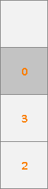

# الستاك (Stack)

## التعريف

الستاك هو بنية بيانات في مكتبة STL تُستخدم لتخزين واسترجاع العناصر بنظام LIFO (آخر الداخل، أول الخارج)، مما يعني أنه يمكن إضافة العناصر إلى نهاية الستاك فقط، والعنصر الأخير المضاف هو الوحيد الذي يمكن الوصول إليه (عرض، تعديل، أو حذف).

في الستاك، تُجرى جميع العمليات في نهاية واحدة، وهي النهاية اليمنى، التي يُشار إليها عادةً بـ"القمة" (top).

## عمليات الستاك

هناك بعض العمليات المستخدمة في الستاك لإضافة عناصر جديدة، والوصول إليها، وإزالتها:

* **Add**: إدراج عنصر جديد في نهاية الستاك (القمة).
* **Remove**: حذف العنصر الأخير المضاف إلى الستاك (العنصر في القمة).
* **Get**: إرجاع العنصر الأخير المضاف إلى الستاك (العنصر في القمة).

جميع العمليات المدعومة في الستاك لها تعقيد زمني $O(1)$، لذا فإن التعقيد الكلي للستاك هو $O(1)$. أما التعقيد المكاني للستاك فيكون $O(n)$ حيث $n$ هو عدد العناصر.

## مثال على الستاك

لنلاحظ كيف يعمل الستاك عند تطبيق العمليات التالية بالترتيب:

1. Add 2
2. Add 3
3. Get
4. Add 0
5. Remove
6. Add 1
7. Remove
8. Get

<div align="center">
    
    
    <p><em>(1) في البداية الستاك فارغ، بعد العملية الأولى يُضاف العنصر 2 إلى القمة</em></p>
</div>

<div align="center">
    
    
    <p><em>(2) بعد العملية الثانية يُضاف العنصر 3 إلى القمة</em></p>
</div>

<div align="center">
    
    <p><em>(3) العملية الثالثة هي Get، والنتيجة هي العنصر في القمة (3)</em></p>
</div>

<div align="center">
    
    
    <p><em>(4) العملية الرابعة هي Add 0، فيُضاف العنصر 0 إلى القمة</em></p>
</div>

<div align="center">
    
    
    <p><em>(5) العملية الخامسة هي Remove، فيُحذف العنصر في القمة</em></p>
</div>

<div align="center">
    
    
    <p><em>(6) العملية السادسة هي Add 1، فيُضاف العنصر 1 إلى القمة</em></p>
</div>

<div align="center">
    
    
    <p><em>(7) العملية السابعة هي Remove، فيُحذف العنصر في القمة</em></p>
</div>

<div align="center">
    
    <p><em>(8) العملية الثامنة هي Get، والنتيجة هي العنصر في القمة (3)</em></p>
</div>

## تنفيذ الستاك في C++

```c++
#include <iostream>
#include <stack> // الرأس الرئيسي للستاك

using namespace std;

int main() {
    /*
    في C++:
        push لإضافة العناصر إلى الستاك
        pop لإزالة آخر عنصر في الستاك
        top للحصول على آخر عنصر في الستاك
    */

    // إنشاء ستاك فارغ
    stack<int> items;

    // Add 2
    items.push(2);
    // الآن items = [2] <- العنصر في القمة

    // Add 3
    items.push(3);
    // الآن items = [2, 3] <- العنصر في القمة

    // Get
    cout << "العنصر في القمة هو: " << items.top() << endl;
    // يطبع 3

    // Add 0
    items.push(0);
    // الآن items = [2, 3, 0] <- العنصر في القمة

    // Remove
    items.pop();
    // يزيل 0، الآن items = [2, 3] <- العنصر في القمة

    // Add 1
    items.push(1);
    // الآن items = [2, 3, 1] <- العنصر في القمة

    // Remove
    items.pop();
    // يزيل 1، الآن items = [2, 3] <- العنصر في القمة

    // Get
    cout << "العنصر في القمة هو: " << items.top() << endl;
    // يطبع 3
}
```

```plaintext
المخرجات:
العنصر في القمة هو: 3
العنصر في القمة هو: 3
```
